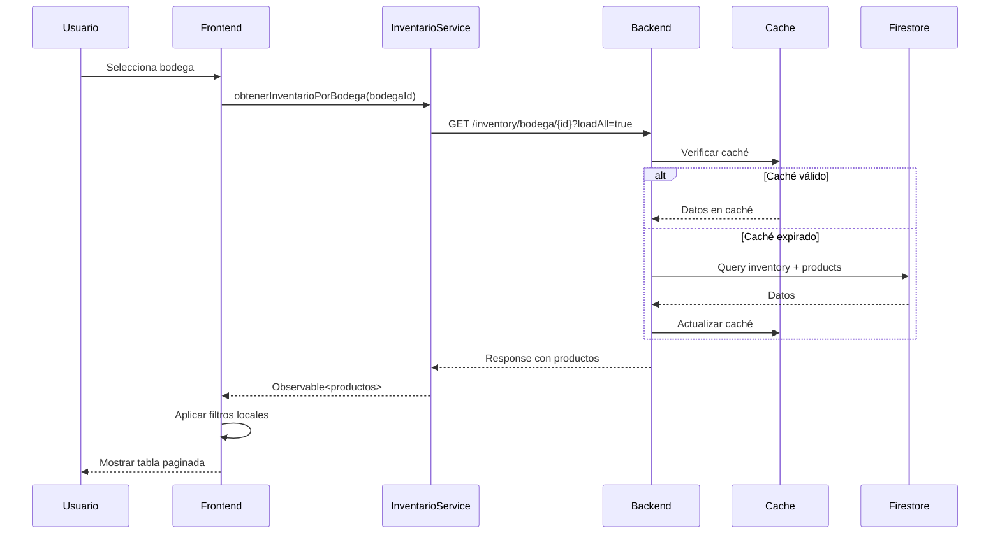
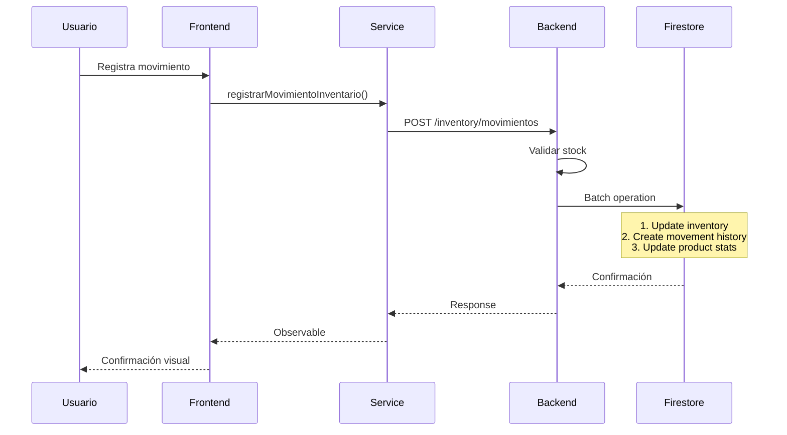

# Arquitectura del Sistema de Inventarios - Katuq Seller

## 📋 Resumen General

El sistema de inventarios de Katuq Seller es una solución integral para la gestión de productos en múltiples bodegas, implementada con Angular 14 en el frontend y Firebase Functions en el backend. El sistema maneja movimientos de inventario, traslados entre bodegas, y procesos de picking/packing para órdenes.

## 🏗️ Arquitectura Frontend (Angular)

### Estructura del Módulo

```
src/app/components/inventarios/
├── inventario.module.ts                 # Módulo principal
├── inventario-routing.module.ts         # Configuración de rutas
├── inventario-catalogo/                 # Catálogo de productos
│   ├── inventarios.component.ts
│   └── inventarios.component.html
├── bodegas/                             # Gestión de bodegas
│   ├── bodegas.component.ts
│   └── crear-bodegas/
├── recepcion-mercancia/                 # Recepción de productos
├── traslados/                           # Traslados entre bodegas
├── historial-movimientos/               # Historial de movimientos
└── model/
    └── movimientoinventario.ts          # Interfaces TypeScript

```

### Componentes Principales

#### 1. **InventarioCatalogoComponent** (`inventarios.component.ts`)
- **Propósito**: Visualización y gestión del catálogo de productos por bodega
- **Características clave**:
  - Filtrado local por cantidad, precio y referencia
  - Ordenamiento por múltiples criterios
  - Paginación con control de tamaño de página
  - Sistema de caché para productos sin filtro
  - Integración con tour guiado para nuevos usuarios

#### 2. **BodegasComponent**
- Gestión de bodegas (almacenes)
- CRUD de bodegas
- Visualización de capacidad y ubicación

#### 3. **RecepcionMercanciaComponent**
- Ingreso de mercancía al inventario
- Registro de órdenes de compra
- Validación de cantidades

#### 4. **TrasladosComponent**
- Movimientos entre bodegas
- Tracking de traslados en proceso
- Historial de movimientos

#### 5. **HistorialMovimientosComponent**
- Registro completo de todos los movimientos
- Filtros por fecha, bodega y tipo
- Exportación a Excel

### Servicios

#### **InventarioService** (`inventario.service.ts`)
```typescript
class InventarioService {
  // Endpoints principales
  registrarMovimientoInventario(movimientos: MovimientoInventario[])
  ingresarProductos(bodegaId, productos, tipoMovimiento, observaciones)
  obtenerInventarioPorBodega(bodegaId)
  realizarTraslado(traslado: Traslado)
  getHistorialMovimientos(filtros)
  
  // URL base: environment.urlApi + '/v1'
}
```

### Modelos de Datos

#### MovimientoInventario
```typescript
interface MovimientoInventario {
  productId: string
  productRef: string
  cantidadCambio: number
  clienteDocumento: string
  tipoMovimiento: 'in' | 'out'
  origenMovimiento: string
  fecha: string
  ordenId: string
  usuario: string
  company: string
  canal: string
  ubicacion: string
}
```

#### ProductoInventario
```typescript
interface ProductoInventario extends Producto {
  cantidad?: number
  bodegaId?: string
  bodegaNombre?: string
}
```

## 🔥 Arquitectura Backend (Firebase Functions)

### Estructura del Controlador

```javascript
// katuq_admin_back_firebase/functions/controllers/inventory.js

module.exports = {
  // Consultas
  getProductoBodega,
  getProductosBodega,
  getInventarioBodega,
  getResumenInventario,
  
  // Movimientos
  ingresarProducto,
  ingresarMultiplesProductos,
  editarProducto,
  moverProducto,
  
  // Historial
  getMovimientosBodega,
  getMovimientosProducto,
  getHistorialMovimientos,
  
  // Picking y Packing
  iniciarPicking,
  completarPicking,
  iniciarPacking,
  completarPacking,
  
  // Validaciones
  validarStock,
  getTiposMovimiento
}
```

### Sistema de Caché

```javascript
const cache = {
  productos: new Map(),
  bodegas: new Map(),
  movimientos: new Map(),
  lastUpdate: new Map(),
  TTL: 30000, // 30 segundos
  
  get: function(key, type) { /* ... */ },
  set: function(key, value, type) { /* ... */ },
  cleanup: function() { /* ... */ }
}
```

- **TTL**: 30 segundos
- **Tipos de caché**: productos, bodegas, movimientos
- **Limpieza automática**: Cada 30 segundos

### Tipos de Movimiento

```javascript
const TIPOS_MOVIMIENTO = {
  // Ingresos
  INGRESO_INVENTARIO_FISICO: "Ingreso por inventario fisico",
  INGRESO_COMPRA: "Ingreso por compra",
  INGRESO_PRODUCCION: "Ingreso por Produccion",
  INGRESO_AJUSTE: "Ingreso por Ajuste de inventario",
  INGRESO_MOVIMIENTO: "Ingreso por movimientos entre bodegas",
  
  // Salidas
  SALIDA_INVENTARIO_FISICO: "Salida por inventario fisico",
  SALIDA_VENTA_POS: "Salida por venta POS",
  SALIDA_VENTA_ASISTIDA: "Salida por venta Asistida",
  SALIDA_OBSEQUIO: "Salida por obsequio",
  SALIDA_AJUSTE: "Salida por ajuste de inventario",
  SALIDA_ROBO: "Salida por robo",
  
  // Picking y Packing
  PICKING_INICIO: "Inicio de picking para pedido",
  PICKING_CANCELACION: "Cancelación de picking",
  PICKING_COMPLETADO: "Picking completado",
  PACKING_INICIO: "Inicio de packing para pedido",
  PACKING_CANCELACION: "Cancelación de packing",
  PACKING_COMPLETADO: "Packing completado"
}
```

### Optimizaciones de Rendimiento

1. **Consultas Paralelas**: Uso de `Promise.all()` para ejecutar múltiples consultas simultáneamente
2. **Paginación Eficiente**: Límite configurable con soporte para carga completa (`loadAll=true`)
3. **Caché Multinivel**: Caché para productos, bodegas y totales
4. **Consultas Optimizadas**: Uso de `.count()` en lugar de `.size` para totales
5. **Deduplicación**: Eliminación de IDs duplicados antes de consultas

## 🔄 Flujo de Datos

### Flujo de Visualización de Inventario



### Flujo de Movimiento de Inventario



## 🚀 Características Clave

### Frontend
- **Filtrado Avanzado**: Por cantidad (agotados/bajos/disponibles), precio, referencia
- **Ordenamiento Múltiple**: Por nombre, precio, cantidad, referencia
- **Paginación Dinámica**: Control de tamaño de página (10, 20, 50 items)
- **Tour Guiado**: Introducción interactiva para nuevos usuarios
- **Exportación**: Descarga de datos en formato Excel

### Backend
- **Validaciones Robustas**: Stock disponible, límites de ajuste (max 1000), permisos
- **Operaciones en Lote**: Uso de `batch` para operaciones atómicas
- **Historial Completo**: Registro de todos los movimientos con trazabilidad
- **Picking/Packing**: Soporte para procesos de preparación de pedidos
- **Multi-bodega**: Gestión de inventario distribuido

## 📊 Colecciones de Firestore

### `inventory`
- Inventario actual por producto y bodega
- Campos: `productoId`, `idBodega`, `cantidad`, `company`, `updatedAt`

### `inventoryProductHistory`
- Historial de movimientos de inventario
- Campos: `productId`, `cantidadCambio`, `tipoMovimiento`, `fecha`, `usuario`

### `warehouses`
- Información de bodegas/almacenes
- Campos: `idBodega`, `nombre`, `direccion`, `ciudad`, `tipo`, `company`

### `products`
- Catálogo de productos
- Referenciado por inventario para detalles del producto

## 🔧 Configuración y Despliegue

### Variables de Entorno
```typescript
// environment.ts
export const environment = {
  urlApi: 'https://api.katuq.com', // URL del backend
  firebase: { /* configuración Firebase */ }
}
```

### Comandos Útiles
```bash
# Frontend
npm start                 # Desarrollo
npm run build:prod       # Build producción

# Backend (Firebase Functions)
firebase deploy --only functions:inventory
```

## 📈 Métricas y Monitoreo

### KPIs Monitoreados
- Tiempo de respuesta de consultas
- Hit rate del caché
- Volumen de movimientos por tipo
- Stock bajo por bodega
- Productos más movidos

### Alertas Configuradas
- Stock bajo (< inventario de seguridad)
- Ajustes mayores a 500 unidades
- Fallas en sincronización
- Tiempo de respuesta > 3 segundos

## 🔐 Seguridad

### Validaciones
- Autenticación mediante headers (`company`, `email`)
- Validación de permisos por bodega
- Límites en ajustes de inventario
- Validación de referencias cruzadas

### Auditoría
- Registro de usuario en cada movimiento
- Timestamp en todas las operaciones
- Trazabilidad completa de cambios
- Backup diario de movimientos

## 🎯 Próximas Mejoras Planificadas

1. **Sincronización Offline**: Soporte para operaciones sin conexión
2. **Predicción de Stock**: ML para predicción de demanda
3. **Alertas Proactivas**: Notificaciones push para stock crítico
4. **Dashboard Analytics**: Panel de análisis de inventario
5. **Integración ERP**: Conectores para sistemas externos
6. **Inventario Cíclico**: Programación de conteos periódicos