# 🏗️ Arquitectura Completa de Katuq - Documento para Clase

**Autor:** Equipo de Desarrollo Katuq  
**Fecha:** Enero 2025  
**Versión:** 2.0  
**Propósito:** Documentación completa de arquitectura para presentación académica

---

## 📋 Tabla de Contenidos

1. [Resumen Ejecutivo](#resumen-ejecutivo)
2. [Visión General del Sistema](#visión-general-del-sistema)
3. [Arquitectura de Alto Nivel](#arquitectura-de-alto-nivel)
4. [Frontend - Angular 14](#frontend---angular-14)
5. [Backend - Firebase Functions](#backend---firebase-functions)
6. [KAI - Sistema de Inteligencia Artificial](#kai---sistema-de-inteligencia-artificial)
7. [Flujos de Datos Principales](#flujos-de-datos-principales)
8. [Integraciones Externas](#integraciones-externas)
9. [Seguridad y Autenticación](#seguridad-y-autenticación)
10. [Patrones de Diseño Implementados](#patrones-de-diseño-implementados)
11. [Stack Tecnológico Completo](#stack-tecnológico-completo)

---

## Resumen Ejecutivo

**Katuq** es una plataforma SaaS de e-commerce B2B con arquitectura híbrida **Firebase + AWS**, diseñada para gestionar operaciones multiempresa de pedidos, inventario, logística, producción y dropshipping. El sistema está compuesto por tres componentes principales:

1. **Frontend (Seller.Katuq)**: Aplicación Angular 14 con arquitectura modular
2. **Backend (katuq_admin_back_firebase)**: API REST con Firebase Functions y Express
3. **KAI (kai)**: Sistema de inteligencia artificial basado en Google Genkit y Gemini

### Características Principales

- ✅ **Multi-tenancy**: Soporte para múltiples empresas en una sola instancia
- ✅ **Arquitectura Modular**: Frontend con lazy-loading y backend con microservicios
- ✅ **Inteligencia Artificial**: Agentes autónomos para logística, ventas y análisis
- ✅ **Integraciones**: Shopify, WooCommerce, pasarelas de pago, logística
- ✅ **Escalabilidad**: Diseñado para manejar millones de transacciones

---

## Visión General del Sistema

### Componentes Principales

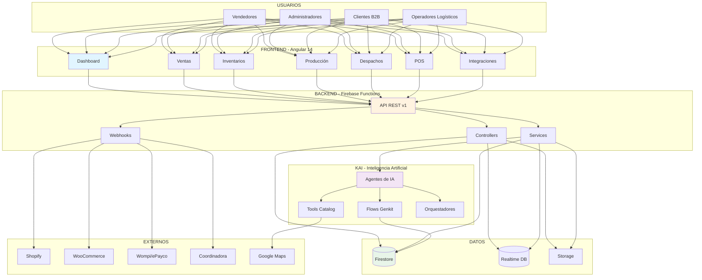

---

## Arquitectura de Alto Nivel

### Diagrama de Capas

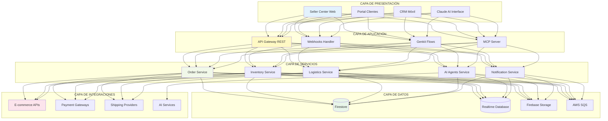

---

## Frontend - Angular 14

### Estructura Modular

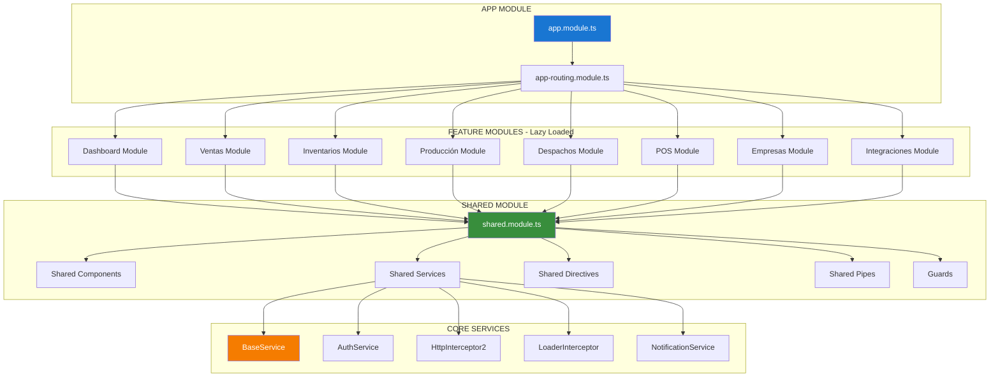

### Arquitectura de Componentes Frontend

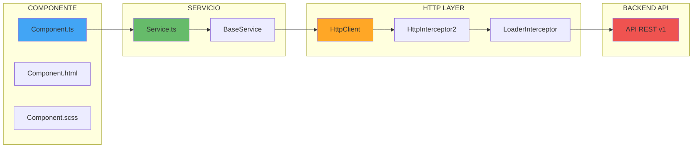

### Módulos Principales del Frontend

| Módulo | Ruta | Descripción | Componentes Principales |
|--------|------|-------------|------------------------|
| **Dashboard** | `/dashboard` | Métricas y KPIs | DashboardComponent, AnalyticsWidgets |
| **Ventas** | `/ventas` | Gestión de pedidos y clientes | CrearVentasComponent, PedidosComponent, ClientesComponent |
| **Inventarios** | `/inventario` | Catálogo y stock | InventarioCatalogoComponent, BodegasComponent, TrasladosComponent |
| **Producción** | `/produccion` | Control de producción | ProduccionDashboardComponent, TrackingComponent |
| **Despachos** | `/despachos` | Gestión de envíos | DespachosComponent, ShippingOrdersComponent |
| **POS** | `/pos` | Punto de venta | POSComponent, CashClosingComponent |
| **Empresas** | `/empresas` | Configuración multi-empresa | EmpresasComponent, ModuloVariableComponent |
| **Integraciones** | `/integrations` | Conectores externos | IntegrationsListComponent, IntegrationModalComponent |

### Patrón de Servicios Frontend

```typescript
// Estructura típica de un servicio
export class VentasService extends BaseService {
  constructor(
    private http: HttpClient,
    private notificationService: NotificationService
  ) {
    super(http);
  }

  crearPedido(pedido: Pedido): Observable<Pedido> {
    return this.post('/v1/orders/create', pedido);
  }

  obtenerPedidos(filtros: any): Observable<Pedido[]> {
    return this.post('/v1/orders/all/filter/optimized', filtros);
  }
}
```

---

## Backend - Firebase Functions

### Arquitectura en Capas

```mermaid
graph TB
    subgraph "ENTRY POINT"
        EP[index.js]
        EX[Express Server]
    end

    subgraph "ROUTERS LAYER"
        R1[/v1/orders]
        R2[/v1/inventory]
        R3[/v1/logistica]
        R4[/v1/analytics]
        R5[/v1/katuqintelligence]
    end

    subgraph "CONTROLLERS LAYER"
        C1[orders.js]
        C2[inventory.js]
        C3[logistica.js]
        C4[analytics.js]
        C5[katuqintelligence.js]
    end

    subgraph "SERVICES LAYER"
        S1[orderService.js]
        S2[inventoryService.js]
        S3[logisticsManager.js]
        S4[notificationService.js]
    end

    subgraph "REPOSITORIES LAYER"
        REP1[orderRepository.js]
        REP2[inventoryRepository.js]
    end

    subgraph "DATA LAYER"
        DB[(Firestore)]
        SQS[AWS SQS]
    end

    EP --> EX
    EX --> R1 & R2 & R3 & R4 & R5
    R1 --> C1
    R2 --> C2
    R3 --> C3
    R4 --> C4
    R5 --> C5
    C1 --> S1
    C2 --> S2
    C3 --> S3
    C4 --> S4
    S1 --> REP1
    S2 --> REP2
    REP1 & REP2 --> DB
    S4 --> SQS

    style EP fill:#ff6f00,color:#fff
    style C1 fill:#42a5f5
    style S1 fill:#66bb6a
    style DB fill:#4caf50,color:#fff
```

### Estructura de Directorios Backend

```
katuq_admin_back_firebase/functions/
├── index.js                    # Entry point principal
├── config.js                   # Configuración global
├── routers/                    # 86+ routers de API
│   ├── orders.js
│   ├── inventory.js
│   ├── logistica.js
│   └── ...
├── controllers/                # 70+ controladores
│   ├── orders.js
│   ├── inventory.js
│   ├── logistica.js
│   └── ...
├── services/                   # Lógica de negocio
│   ├── orderService.js
│   ├── inventoryService.js
│   ├── logisticsManager.js
│   ├── notifications/
│   └── ...
├── repositories/               # Acceso a datos
│   └── orderRepository.js
├── middleware/                 # Autenticación y validación
│   ├── auth.js
│   ├── usageTracker.js
│   └── ...
├── handlers/                   # Event handlers
│   └── sqsListener.js
├── tools/                      # Herramientas MCP
│   └── ...
└── utils/                      # Utilidades
    └── ...
```

### Flujo de Request en Backend

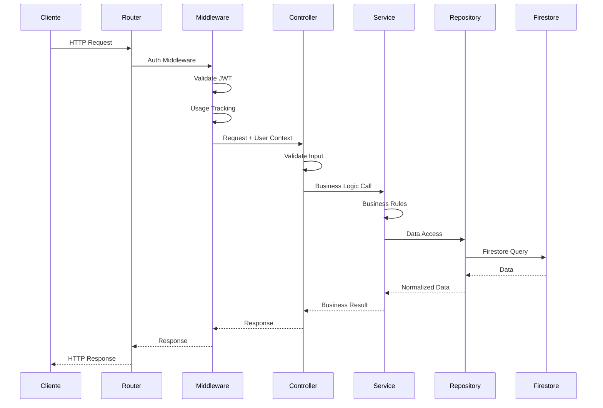

### Módulos Principales del Backend

| Módulo | Controlador | Endpoints Principales | Descripción |
|--------|-------------|----------------------|-------------|
| **Órdenes** | `orders.js` | `/v1/orders/*` | Gestión completa del ciclo de vida de pedidos |
| **Inventario** | `inventory.js` | `/v1/inventory/*` | Control de stock multi-bodega en tiempo real |
| **Logística** | `logistica.js` | `/v1/logistica/*` | Orquestador de envíos y rutas |
| **Analytics** | `analytics.js` | `/v1/analytics/*` | KPIs y métricas de negocio |
| **Katuq Intelligence** | `katuqintelligence.js` | `/v1/katuqintelligence/*` | Predicciones y análisis con IA |
| **Clientes** | `clients.js` | `/v1/clients/*` | Gestión de clientes B2B/B2C |
| **Pagos** | `pagos.js` | `/v1/pagos/*` | Integración con pasarelas de pago |
| **Integraciones** | `shopifyIntegration.js` | `/v1/integrations/*` | Conectores con e-commerce |

---

## KAI - Sistema de Inteligencia Artificial

### Arquitectura de Agentes

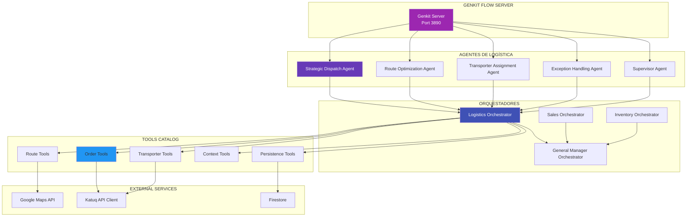

### Flujo Multi-Agente

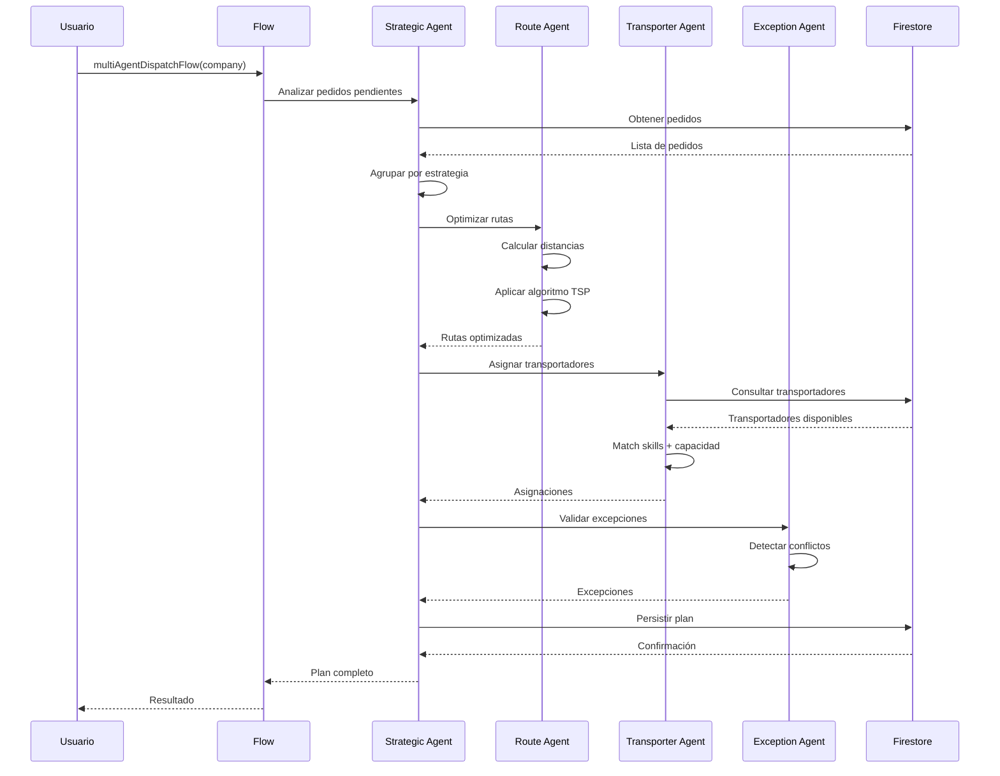

### Protocolos de Comunicación

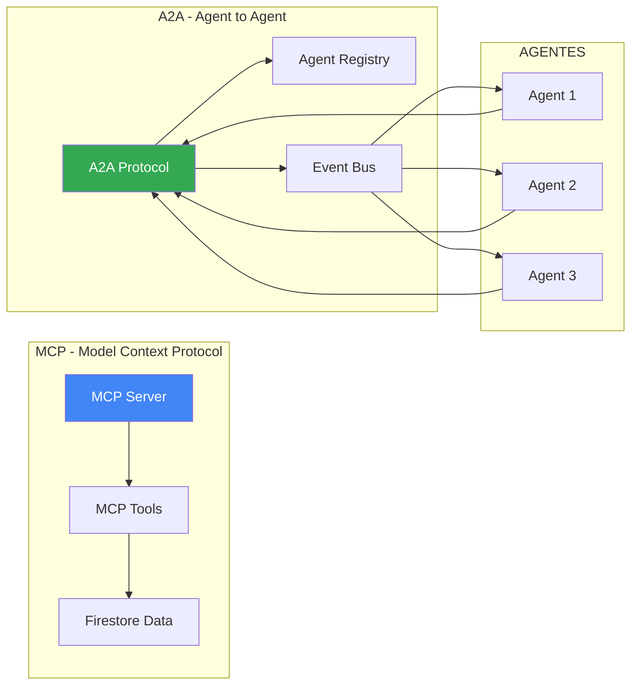

### Agentes Implementados

| Agente | Propósito | Herramientas | Flujo |
|--------|-----------|--------------|-------|
| **Strategic Dispatch** | Planificación logística | orderTools, groupingTools, strategicTools | strategicDispatchFlow |
| **Route Optimization** | Optimización de rutas | routeTools, googleMapsService | multiAgentDispatchFlow |
| **Transporter Assignment** | Asignación de transportadores | transporterTools, assignmentTools | multiAgentDispatchFlow |
| **Exception Handling** | Manejo de excepciones | contextTools, orderTools | multiAgentDispatchFlow |
| **Supervisor** | Supervisión y coordinación | All tools | multiAgentDispatchFlow |
| **Admin Reports** | Reportes administrativos | adminKPIsTools, adminSalesTools | adminReportsFlow |

---

## Flujos de Datos Principales

### Flujo: Creación de Pedido

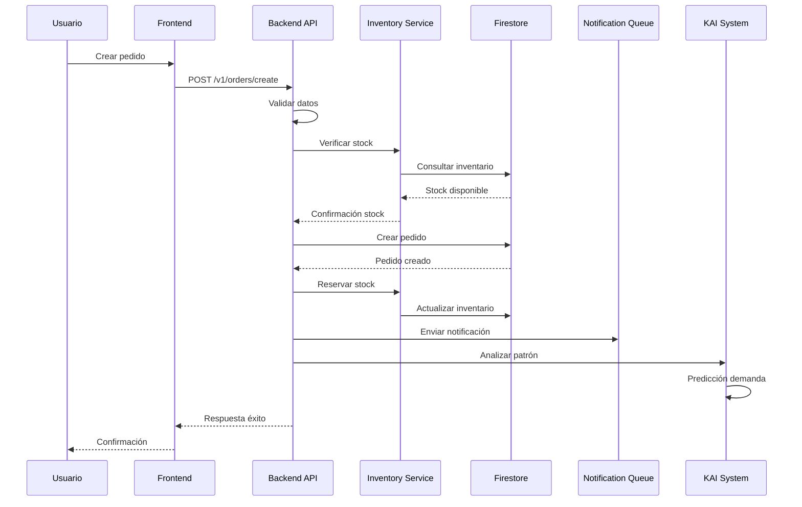

### Flujo: Optimización de Rutas con KAI

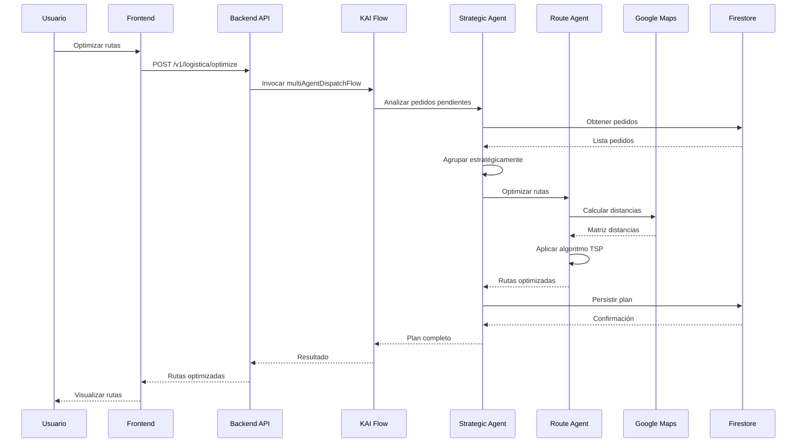

### Flujo: Sincronización con E-commerce

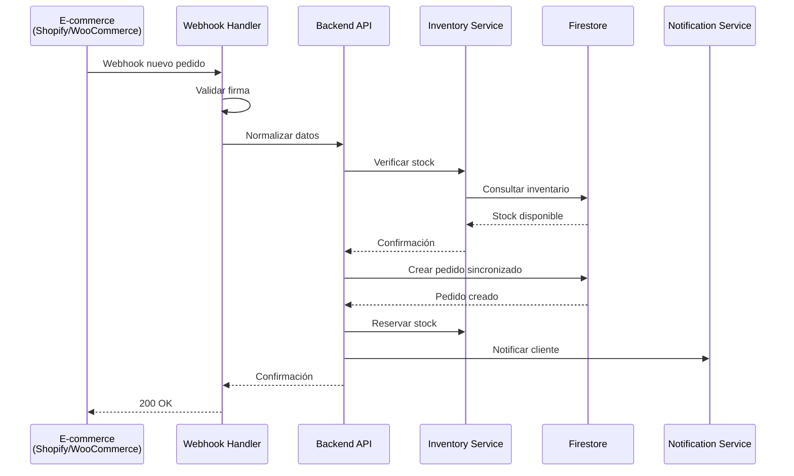

---

## Integraciones Externas

### Mapa de Integraciones

```mermaid
graph TB
    subgraph "KATUQ PLATFORM"
        K[Katuq Core]
    end

    subgraph "E-COMMERCE"
        E1[Shopify]
        E2[WooCommerce]
        E3[Virtual Store]
    end

    subgraph "PAYMENT GATEWAYS"
        P1[Wompi]
        P2[ePayco]
        P3[Mercado Pago]
    end

    subgraph "LOGISTICS"
        L1[Coordinadora]
        L2[Interrapidísimo]
        L3[Enviame]
        L4[Partners Logistics]
    end

    subgraph "ACCOUNTING"
        AC1[Siigo]
        AC2[QuickBooks]
    end

    subgraph "AI SERVICES"
        AI1[Google Gemini]
        AI2[Google Maps]
        AI3[Vertex AI]
    end

    subgraph "CRM"
        CRM1[Salesforce]
        CRM2[HubSpot]
        CRM3[Zoho CRM]
    end

    K --> E1 & E2 & E3
    K --> P1 & P2 & P3
    K --> L1 & L2 & L3 & L4
    K --> AC1 & AC2
    K --> AI1 & AI2 & AI3
    K --> CRM1 & CRM2 & CRM3

    style K fill:#ff6f00,color:#fff
    style E1 fill:#96bf48
    style P1 fill:#00a8e6
    style L1 fill:#f7941d
    style AI1 fill:#4285f4,color:#fff
```

### Patrón de Integración

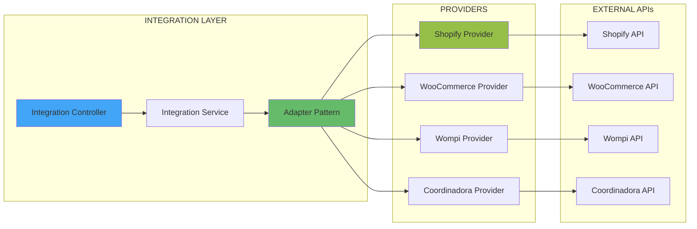

---

## Seguridad y Autenticación

### Arquitectura de Seguridad

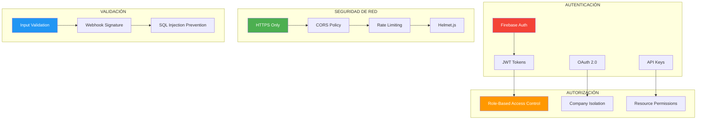

### Flujo de Autenticación

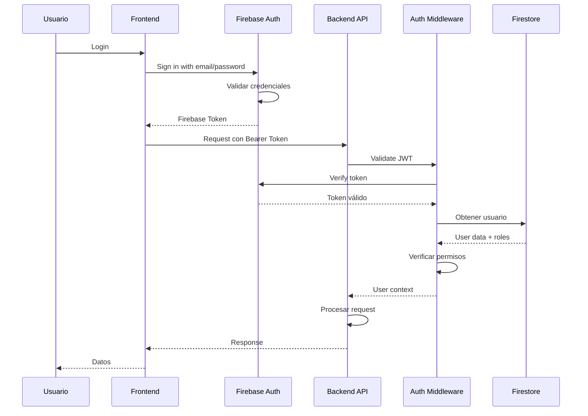

---

## Patrones de Diseño Implementados

### Resumen de Patrones

| Categoría | Patrón | Implementación | Ubicación |
|-----------|--------|-----------------|-----------|
| **Arquitectónicos** | Layered Architecture | Separación Router → Controller → Service → Repository | Todo el backend |
| **Arquitectónicos** | Repository Pattern | Abstracción de acceso a datos | `repositories/` |
| **Arquitectónicos** | Service Layer | Lógica de negocio encapsulada | `services/` |
| **Creacionales** | Singleton | Servicios compartidos | `orderService.js`, `inventoryService.js` |
| **Creacionales** | Factory | Creación dinámica de clientes | `ResilienceFactory` |
| **Estructurales** | Strategy | Proveedores intercambiables | `shippingProviders/` |
| **Estructurales** | Adapter | Compatibilidad legacy/moderno | `LegacyConfigAdapter` |
| **Estructurales** | Facade | Interfaz simplificada | `LogisticsManager` |
| **Comportamentales** | Observer | Sistema de eventos | Webhooks, SQS listeners |
| **Resiliencia** | Circuit Breaker | Protección contra fallos | `ResilientHttpClient` |
| **Resiliencia** | Retry Pattern | Reintentos automáticos | `ResilientHttpClient` |
| **Resiliencia** | Rate Limiting | Control de tráfico | `RateLimiter` |
| **Datos** | Cache-Aside | Cache distribuido | `DistributedCache` |
| **Datos** | Multi-tenancy | Segregación por empresa | Todas las queries |

---

## Stack Tecnológico Completo

### Frontend

| Tecnología | Versión | Propósito |
|------------|---------|-----------|
| **Angular** | 14.3.0 | Framework principal |
| **TypeScript** | 4.7.x | Lenguaje de programación |
| **PrimeNG** | 14.2.x | Componentes UI |
| **Bootstrap** | 5.2.x | Framework CSS |
| **RxJS** | 7.x | Programación reactiva |
| **Firebase SDK** | 9.17.x | Integración con Firebase |
| **ApexCharts** | Latest | Visualización de datos |
| **ngx-translate** | Latest | Internacionalización |

### Backend

| Tecnología | Versión | Propósito |
|------------|---------|-----------|
| **Node.js** | 20 | Runtime |
| **Express** | 4.x | Framework web |
| **Firebase Functions** | Latest | Serverless functions |
| **Firestore** | Latest | Base de datos NoSQL |
| **AWS SDK** | 3.x | Integración AWS (SQS, X-Ray) |
| **Swagger** | Latest | Documentación API |
| **JWT** | Latest | Autenticación |

### KAI (Inteligencia Artificial)

| Tecnología | Versión | Propósito |
|------------|---------|-----------|
| **Google Genkit** | 1.24.0 | Framework de IA |
| **Gemini AI** | Latest | Modelo de lenguaje |
| **Vertex AI** | Latest | Servicios de ML |
| **TypeScript** | 4.9.5 | Lenguaje de programación |
| **WebSocket** | 8.x | Comunicación en tiempo real |

### Infraestructura

| Servicio | Propósito |
|----------|-----------|
| **Firebase Hosting** | Hosting del frontend |
| **Firebase Functions** | Backend serverless |
| **Firestore** | Base de datos principal |
| **Firebase Storage** | Almacenamiento de archivos |
| **AWS SQS** | Cola de mensajes |
| **AWS X-Ray** | Tracing distribuido |
| **Google Cloud** | Servicios de IA |

---

## Métricas y Escalabilidad

### Capacidad del Sistema

- **Usuarios concurrentes**: 10,000+
- **Pedidos por día**: 100,000+
- **Empresas multi-tenant**: 1,000+
- **Productos por empresa**: 100,000+
- **Transacciones por segundo**: 1,000+

### Optimizaciones Implementadas

1. **Lazy Loading**: Módulos Angular cargados bajo demanda
2. **Caché Multinivel**: Frontend, backend y Firestore
3. **Paginación**: Consultas optimizadas con límites
4. **Batch Operations**: Operaciones en lote para Firestore
5. **CDN**: Firebase Hosting con CDN global
6. **Indexación**: Índices optimizados en Firestore

---

## Conclusión

Katuq es una plataforma SaaS robusta y escalable que combina:

- ✅ **Frontend moderno** con Angular 14 y arquitectura modular
- ✅ **Backend serverless** con Firebase Functions y Express
- ✅ **Inteligencia Artificial** con Google Genkit y agentes autónomos
- ✅ **Multi-tenancy** para soportar múltiples empresas
- ✅ **Integraciones extensas** con e-commerce, pagos y logística
- ✅ **Arquitectura resiliente** con patrones de diseño probados

La arquitectura está diseñada para crecer y adaptarse a las necesidades del negocio, utilizando las mejores prácticas de la industria y tecnologías de vanguardia.

---

**Última actualización**: Enero 2025  
**Versión del documento**: 2.0  
**Mantenido por**: Equipo de Desarrollo Katuq


