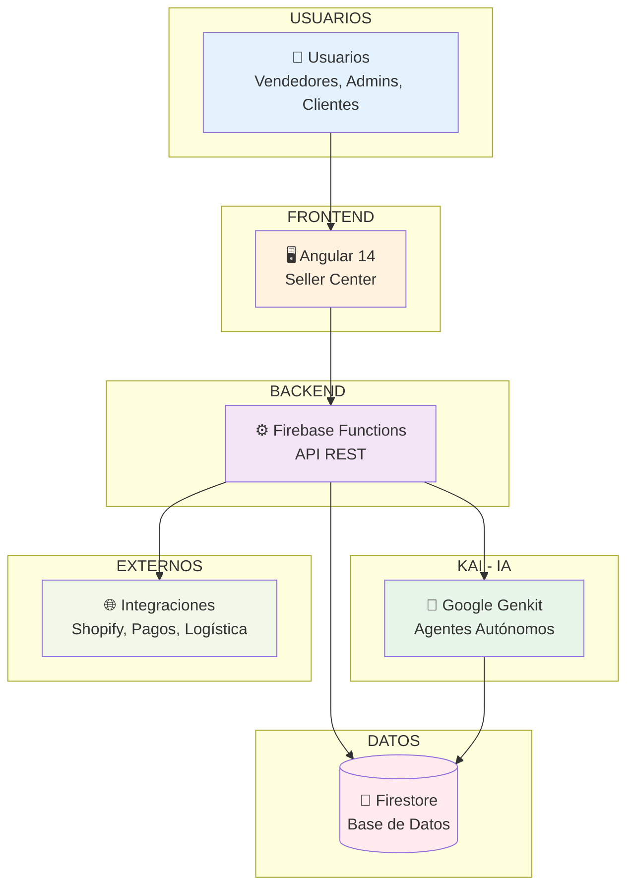
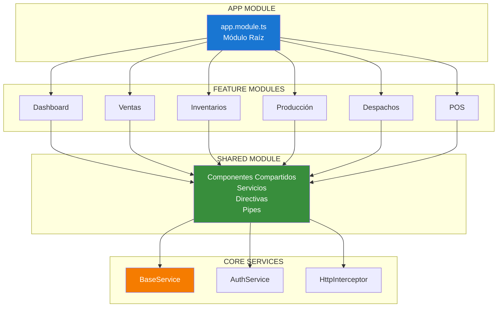
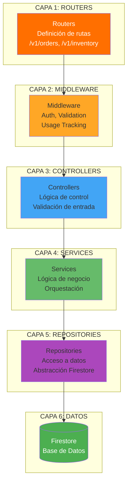
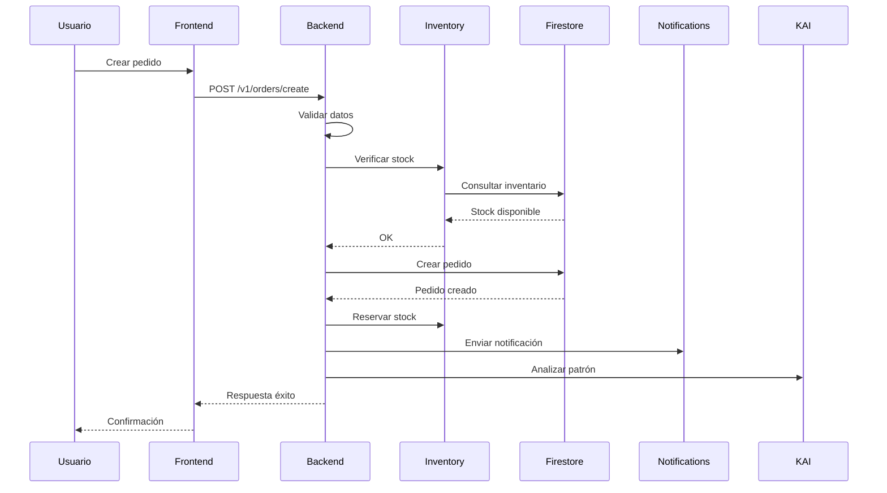

# 🎓 Presentación: Arquitectura de Katuq

**Para uso en clase académica**  
**Duración estimada**: 45-60 minutos  
**Nivel**: Intermedio-Avanzado

---

## 📑 Índice de la Presentación

1. [Introducción](#1-introducción)
2. [¿Qué es Katuq?](#2-qué-es-katuq)
3. [Arquitectura General](#3-arquitectura-general)
4. [Frontend: Angular 14](#4-frontend-angular-14)
5. [Backend: Firebase Functions](#5-backend-firebase-functions)
6. [KAI: Sistema de IA](#6-kai-sistema-de-ia)
7. [Flujos de Datos](#7-flujos-de-datos)
8. [Integraciones](#8-integraciones)
9. [Casos de Uso Reales](#9-casos-de-uso-reales)
10. [Conclusiones](#10-conclusiones)

---

## 1. Introducción

### Objetivos de la Presentación

- Comprender la arquitectura completa de Katuq
- Analizar las decisiones de diseño arquitectónico
- Identificar patrones de diseño implementados
- Evaluar la escalabilidad y mantenibilidad

### Contexto del Proyecto

**Katuq** es una plataforma SaaS de e-commerce B2B que gestiona:
- Pedidos y ventas
- Inventario multi-bodega
- Logística y despachos
- Producción
- Integraciones con e-commerce

---

## 2. ¿Qué es Katuq?

### Problema que Resuelve

```
┌─────────────────────────────────────────────────────────┐
│  PROBLEMA: Empresas B2B necesitan gestionar múltiples   │
│  aspectos de su negocio en una sola plataforma          │
└─────────────────────────────────────────────────────────┘
                          │
                          ▼
┌─────────────────────────────────────────────────────────┐
│  SOLUCIÓN: Katuq - Plataforma SaaS unificada           │
│  • Gestión de pedidos                                   │
│  • Control de inventario                                │
│  • Optimización logística con IA                        │
│  • Integraciones con e-commerce                         │
└─────────────────────────────────────────────────────────┘
```

### Características Principales

- 🌐 **Multi-tenancy**: Múltiples empresas en una instancia
- 🤖 **Inteligencia Artificial**: Agentes autónomos para optimización
- 🔗 **Integraciones**: Shopify, WooCommerce, pasarelas de pago
- 📊 **Analytics**: Dashboards y KPIs en tiempo real
- 🚀 **Escalable**: Diseñado para millones de transacciones

---

## 3. Arquitectura General

### Vista de Alto Nivel



### Los Tres Pilares

```
┌─────────────────────────────────────────────────────────────┐
│                    ARQUITECTURA KATUQ                      │
├─────────────────────────────────────────────────────────────┤
│                                                             │
│  ┌──────────────┐    ┌──────────────┐    ┌──────────────┐ │
│  │   FRONTEND   │    │    BACKEND   │    │      KAI     │ │
│  │              │    │              │    │              │ │
│  │  Angular 14  │◄───┤ Firebase     │◄───┤ Google Genkit│ │
│  │  Modular     │    │ Functions    │    │ Agentes IA   │ │
│  │  Lazy Load   │    │ Express API  │    │ Flows        │ │
│  └──────────────┘    └──────────────┘    └──────────────┘ │
│         │                   │                   │           │
│         └───────────────────┴───────────────────┘           │
│                             │                               │
│                    ┌─────────▼─────────┐                   │
│                    │    FIRESTORE      │                   │
│                    │   (Base de Datos) │                   │
│                    └──────────────────┘                   │
└─────────────────────────────────────────────────────────────┘
```

---

## 4. Frontend: Angular 14

### Arquitectura Modular



### Ventajas de la Arquitectura Modular

✅ **Lazy Loading**: Carga bajo demanda  
✅ **Separación de Responsabilidades**: Cada módulo es independiente  
✅ **Reutilización**: Componentes compartidos en SharedModule  
✅ **Mantenibilidad**: Fácil de mantener y escalar  
✅ **Testing**: Módulos testeados independientemente

### Flujo de Datos Frontend

```
┌─────────────┐
│  Component  │
│  (Vista)    │
└──────┬──────┘
       │
       ▼
┌─────────────┐
│   Service   │
│  (Lógica)   │
└──────┬──────┘
       │
       ▼
┌─────────────┐
│  HttpClient │
└──────┬──────┘
       │
       ▼
┌─────────────┐
│ Interceptor │
└──────┬──────┘
       │
       ▼
┌─────────────┐
│  Backend API│
└─────────────┘
```

### Ejemplo: Módulo de Ventas

```typescript
// Estructura del módulo
ventas/
├── ventas.module.ts          // Módulo principal
├── ventas-routing.module.ts  // Rutas
├── crear-ventas/            // Componente crear
├── pedidos/                  // Componente listado
├── clientes/                 // Componente clientes
└── services/
    └── ventas.service.ts     // Servicio de negocio
```

---

## 5. Backend: Firebase Functions

### Arquitectura en Capas



### Ejemplo: Flujo de un Pedido

```
1. Cliente hace request
   ↓
2. Router recibe /v1/orders/create
   ↓
3. Middleware valida JWT
   ↓
4. Controller valida datos
   ↓
5. Service ejecuta lógica:
   - Verificar stock
   - Calcular totales
   - Aplicar descuentos
   ↓
6. Repository guarda en Firestore
   ↓
7. Response al cliente
```

### Patrón Repository

**¿Por qué usar Repository?**

✅ **Desacoplamiento**: La lógica de negocio no depende de Firestore  
✅ **Testeable**: Fácil de mockear en tests  
✅ **Flexible**: Puede cambiar de BD sin afectar servicios

```javascript
// Ejemplo de Repository
class OrderRepository {
  async create(orderData) {
    return await db.collection('orders').add(orderData);
  }
  
  async findByCompany(companyId) {
    return await db.collection('orders')
      .where('company', '==', companyId)
      .get();
  }
}
```

---

## 6. KAI: Sistema de IA

### ¿Qué es KAI?

**Katuq Artificial Intelligence** - Sistema de agentes autónomos que:
- Optimizan rutas de entrega
- Predicen demanda
- Asignan transportadores
- Manejan excepciones

### Arquitectura de Agentes

```mermaid
graph TB
    subgraph "FLOW ORQUESTADOR"
        FO[multiAgentDispatchFlow]
    end

    subgraph "AGENTES ESPECIALIZADOS"
        A1[Strategic Dispatch<br/>Planificación]
        A2[Route Optimization<br/>Optimización rutas]
        A3[Transporter Assignment<br/>Asignación]
        A4[Exception Handling<br/>Manejo errores]
    end

    subgraph "HERRAMIENTAS"
        T1[Order Tools]
        T2[Route Tools]
        T3[Google Maps]
    end

    FO --> A1
    A1 --> A2
    A1 --> A3
    A1 --> A4
    A1 --> T1
    A2 --> T2
    T2 --> T3

    style FO fill:#9c27b0,color:#fff
    style A1 fill:#673ab7,color:#fff
    style T1 fill:#2196f3
```



### Ejemplo Real: Optimización de Rutas

**Antes (Manual)**:
- ⏱️ Tiempo: 2-3 horas
- 👤 Requiere: Planificador experto
- ❌ Errores: Frecuentes
- 💰 Costo: Alto

**Después (Con KAI)**:
- ⏱️ Tiempo: 30 segundos
- 🤖 Requiere: Agente de IA
- ✅ Errores: Mínimos
- 💰 Costo: Bajo

**ROI**: 4000% ($600/mes ahorro vs $15/mes costo)

### Flujo de un Agente

```
1. Usuario solicita optimización
   ↓
2. Flow invoca Strategic Dispatch Agent
   ↓
3. Agent analiza pedidos pendientes
   ↓
4. Agent agrupa por estrategia
   ↓
5. Route Agent optimiza rutas
   ↓
6. Transporter Agent asigna transportadores
   ↓
7. Exception Agent valida
   ↓
8. Resultado: Plan optimizado
```

---

## 7. Flujos de Datos

### Flujo Completo: Creación de Pedido



### Flujo: Optimización con IA

```
Usuario → Frontend → Backend API
                        ↓
                   KAI Flow
                        ↓
            Strategic Dispatch Agent
                        ↓
            ┌───────────┴───────────┐
            ↓                       ↓
    Route Optimization      Transporter Assignment
            ↓                       ↓
        Google Maps              Firestore
            ↓                       ↓
            └───────────┬───────────┘
                        ↓
                  Plan Optimizado
                        ↓
                    Firestore
                        ↓
                    Frontend
                        ↓
                    Usuario
```

---

## 8. Integraciones

### Ecosistema de Integraciones

```
┌─────────────────────────────────────────────────────────┐
│                    KATUQ PLATFORM                        │
└────────────────────┬────────────────────────────────────┘
                     │
        ┌────────────┼────────────┐
        │            │            │
        ▼            ▼            ▼
┌───────────┐ ┌──────────┐ ┌──────────┐
│E-commerce │ │ Payments │ │Logistics │
│           │ │          │ │          │
│Shopify    │ │Wompi     │ │Coordinadora│
│WooCommerce│ │ePayco    │ │Interrapid.│
└───────────┘ └──────────┘ └──────────┘
```

### Patrón de Integración

**Strategy Pattern** para proveedores intercambiables:

```javascript
// Base Provider
class BaseShippingProvider {
  async createShipment(order) {
    throw new Error('Must implement');
  }
}

// Implementaciones
class CoordinadoraProvider extends BaseShippingProvider {
  async createShipment(order) {
    // Lógica específica de Coordinadora
  }
}

// Manager selecciona estrategia
const provider = strategies.get('coordinadora');
await provider.createShipment(order);
```

---

## 9. Casos de Uso Reales

### Caso 1: Empresa de Repostería

**Problema**: 
- 50 pedidos diarios
- Planificación manual de rutas
- 3 horas diarias en logística

**Solución Katuq**:
- Sistema automatizado de pedidos
- KAI optimiza rutas en 30 segundos
- Ahorro: 2.5 horas diarias

### Caso 2: Distribuidora B2B

**Problema**:
- Múltiples bodegas
- Control de inventario manual
- Errores frecuentes

**Solución Katuq**:
- Inventario centralizado
- Movimientos en tiempo real
- Alertas automáticas de stock bajo

### Caso 3: E-commerce Multi-canal

**Problema**:
- Vende en Shopify y WooCommerce
- Sincronización manual
- Inventario desactualizado

**Solución Katuq**:
- Integración automática
- Sincronización bidireccional
- Inventario unificado

---

## 10. Conclusiones

### Lecciones Aprendidas

✅ **Arquitectura Modular**: Facilita mantenimiento y escalabilidad  
✅ **Separación de Responsabilidades**: Cada capa tiene un propósito claro  
✅ **Patrones de Diseño**: Soluciones probadas para problemas comunes  
✅ **IA como Servicio**: Agentes autónomos mejoran eficiencia  
✅ **Multi-tenancy**: Una instancia, múltiples clientes

### Métricas de Éxito

- 📈 **Escalabilidad**: 10,000+ usuarios concurrentes
- ⚡ **Performance**: < 2s tiempo de respuesta promedio
- 🎯 **Disponibilidad**: 99.9% uptime
- 💰 **ROI**: 4000% en optimización logística

### Próximos Pasos

- 🔄 Migración a microservicios
- 🤖 Más agentes de IA
- 📊 Analytics avanzados
- 🌍 Expansión internacional

---

## Preguntas y Respuestas

### Preguntas Frecuentes

**Q: ¿Por qué Angular y no React?**  
A: Angular ofrece mejor estructura para aplicaciones empresariales grandes, con TypeScript nativo y arquitectura modular robusta.

**Q: ¿Por qué Firebase y no AWS directamente?**  
A: Firebase ofrece mejor DX (Developer Experience) y integración nativa con servicios de Google, aunque usamos AWS para servicios específicos como SQS.

**Q: ¿Cómo escalan los agentes de IA?**  
A: Los agentes son stateless y se ejecutan en Firebase Functions, que escala automáticamente según la demanda.

**Q: ¿Qué pasa si falla un agente?**  
A: Implementamos Circuit Breaker pattern y retry logic para manejar fallos gracefully.

---

## Recursos Adicionales

- 📚 Documentación completa: `/docs/arquitectura/ARQUITECTURA_COMPLETA_KATUQ.md`
- 🔗 Repositorio: [GitHub/Katuq]
- 📖 API Docs: `/api-docs` (Swagger)
- 🎥 Video tutoriales: [YouTube Channel]

---

**Gracias por su atención** 🎓

---

*Documento preparado para presentación académica*  
*Última actualización: Enero 2025*

