### Guía de Dropshipping para Katuq Seller

#### Resumen ejecutivo
Katuq Seller cuenta con la base técnica y funcional para implementar un módulo de dropshipping robusto en tiempo récord. El flujo de pedidos, despachos y el sistema de integraciones ya existen y solo requieren una capa de orquestación y pequeñas extensiones de modelo/UI para operar con proveedores de dropshipping.

---

### ¿Qué es el dropshipping?
Modelo en el que la tienda vende sin stock propio: al aprobar un pedido, se envía la orden al proveedor, y este despacha directamente al cliente. La tienda mantiene la relación comercial, el precio y la experiencia; el proveedor hace el fulfillment.

---

### Viabilidad en Katuq Seller
**Evidencias en el código:**
- `src/app/shared/services/ventas/ventas.service.ts`: creación/edición de pedidos.
- `src/app/shared/services/despachos/logistica.services.ts` y `.v2.ts`: crear/consultar/ despachar órdenes de envío.
- `src/app/components/ventas/modelo/pedido.ts`: modelo de `Pedido` con campos de logística (`nroShippingOrder`, `transportador`, `fechaYHorarioDespachado`, `fotosEvidencia`, `historialEstadoProceso`, etc.).
- `src/app/components/integrations/`: servicio y UI de integraciones por proveedor (ECOMMERCE, PAYMENT, LOGISTICS) reutilizable para proveedores de dropshipping.

Conclusión: la app está lista para una implementación ágil del flujo de dropshipping.

---

### Mapa de procesos (Mermaid)
- Fuente Mermaid: [dropshipping-map.mmd](dropshipping-map.mmd)
- Exportados: [dropshipping-map.svg](dropshipping-map.svg), [dropshipping-map.png](dropshipping-map.png)



El mapa cubre: pre-venta, checkout, orquestación (separación local vs proveedor), creación de orden al proveedor, webhooks de tracking, estados, integraciones, despachos, facturación, postventa y KPIs.

---

### Perfiles y permisos
- **Administrador (Owner)**: configura roles, SLAs, políticas; acceso total.
- **Gestor de Integraciones**: credenciales, ambientes, validación, webhooks.
- **Gestor de Catálogo**: mapeo SKU proveedor↔SKU interno, reglas de precio, lead time, stock virtual.
- **Vendedor/Dropshipper**: crea pedidos, consulta tracking, postventa (sin acceso a credenciales).
- **Proveedor (Supplier)**: ve pedidos asignados; acepta/rechaza, confirma despacho, tracking, evidencia; gestiona devoluciones.
- **Logística/Despachos**: consolida órdenes, asigna transportador, despacha en lote, actualiza estados.
- **Atención al Cliente**: consulta estados/tracking, gestiona devoluciones y reenvíos.
- **Finanzas/Facturación**: facturación, conciliación con proveedores, márgenes.
- **Auditor/Reportes**: solo lectura a KPIs.

Scopes sugeridos: `productos.*`, `integraciones.*`, `pedidos.*`, `despachos.*`, `devoluciones.*`, `finanzas.*`, `reportes.read`. Proveedor: acceso restringido a `pedidos.asignados` y `productos.propios`.

---

### Diseño funcional
- **Pre-venta**: catálogo marca productos como Dropshipping; sincronización de stock/precio proveedor por Pull (API) + Push (webhooks).
- **Checkout y pago**: al aprobar, se orquesta el pedido; separación de ítems locales vs proveedor.
- **Orquestación**:
  - Ítems locales: flujo normal y descuento de stock local.
  - Ítems dropshipping: NO descuentan stock local; se crea orden al proveedor; manejo de aceptación/rechazo y reintentos.
- **Fulfillment proveedor**: proveedor despacha; se registra `nroShippingOrder` y tracking; actualización por webhook/callback.
- **Estados**:
  - `estadoPago`: Pendiente → PreAprobado → Aprobado → (Rechazado/Cancelado).
  - `estadoProceso` propuesto para DS (mapeable a existentes): “Solicitado a Proveedor” → “Despachado por Proveedor” → “Entregado”. Opcionales: Empacado, ParaDespachar, Cerrado.
- **Despachos**: vista centralizada para shipping orders; consolidación y actualización en lote.

---

### Diseño técnico
- **Modelo de producto**: extender `Producto` con una sección opcional, por ejemplo:
```ts
interface ProveedorDropshippingConfig {
  providerId: string;
  supplierSku: string;
  leadTimeDays?: number;
  priceRule?: { type: 'markup' | 'fixed'; value: number };
  stockMode?: 'virtual' | 'reserved' | 'on_demand';
}

// src/app/shared/models/productos/Producto.ts
export interface Producto {
  // ...
  dropshipping?: ProveedorDropshippingConfig;
}
```
- **Servicio de orquestación** (`DropshippingService` sugerido):
  - Crear orden al proveedor al aprobar pedido.
  - Consultar estado/stock/precio y manejar reintentos.
  - Mapear estados proveedor → `estadoProceso` y actualizar `nroShippingOrder`/tracking.
- **Integraciones**: reutilizar `IntegrationsService` para credenciales/health-check/webhooks (categoría LOGISTICS/OTHER). Endpoints backend: crear orden, consultar estado, recibir webhooks.
- **UI**:
  - Producto: pestaña “Proveedor” para configurar mapeo y reglas de precio.
  - Checkout/ventas: banderas para ítems DS; mostrar proveedor, ETA y condiciones.
  - Despachos: filtros y visualización para “Despachado por Proveedor”.

---

### MVP y roadmap
- **MVP (5–10 días hábiles)**
  - Bandera DS en producto + mapeo básico de SKU proveedor.
  - Orquestación: separar ítems, crear orden a proveedor y registrar tracking.
  - No descontar stock local para ítems DS; usar stock virtual proveedor.
  - Estados mínimos: “Solicitado a Proveedor”, “Despachado por Proveedor”, “Entregado”.
  - Integración inicial con 1 proveedor (REST simple) vía `IntegrationsService`.
  - Vista mínima de monitoreo de pedidos DS.

- **Robusto multi-proveedor (3–4 semanas)**
  - Pricing rules avanzadas, reconciliación, reintentos con colas, SLA.
  - Devoluciones/RMA, conciliación financiera por proveedor.
  - Reportes/KPIs y auditoría completa.

---

### KPIs y auditoría
- Fill rate del proveedor
- OTIF/SLA (On-time In-Full)
- Tasa de rechazo/stock mismatch
- Margen por proveedor/SKU
- Tiempo de ciclo del pedido DS

---

### Riesgos y mitigaciones
- Consistencia de stock: separar inventario local vs proveedor; no decrementar local para DS.
- Rechazos del proveedor: política clara de reintentos y comunicación al cliente.
- SLA/latencias: webhooks + polling con backoff; colas y reintentos en backend.
- Estados: mapear a enums existentes o agregar banderas (`typeOrder: 'Dropshipping'`).

---

### Anexos (referencias rápidas)
- `src/app/components/ventas/modelo/pedido.ts`
- `src/app/shared/services/ventas/ventas.service.ts`
- `src/app/shared/services/despachos/logistica.services.ts` y `logistica.service.v2.ts`
- `src/app/components/integrations/`
- Diagrama: [dropshipping-map.mmd](dropshipping-map.mmd) → [dropshipping-map.svg](dropshipping-map.svg)

