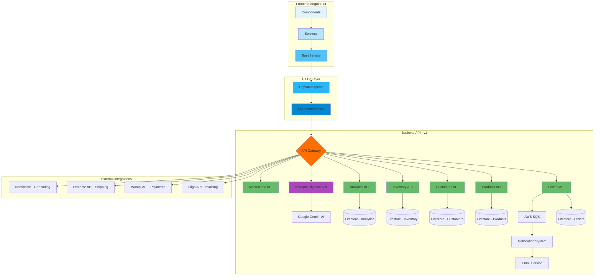

# Endpoints API - Katuq Seller Platform

## Índice
1. [Visión General](#visión-general)
2. [Diagrama de Flujo de Endpoints](#diagrama-de-flujo-de-endpoints)
3. [Endpoints por Módulo](#endpoints-por-módulo)
4. [Esquema de Arquitectura](#esquema-de-arquitectura)

---

## Visión General

La API de Katuq Seller está organizada en **37 categorías funcionales** con un total de **292 endpoints únicos**.

### Estadísticas
- **Base URL**: `environment.urlApi` (configurado en environment.ts)
- **Versión API**: `v1`
- **Métodos HTTP**: GET, POST, PUT, DELETE, PATCH
- **Total de Endpoints**: 292
- **Categorías**: 37

### Distribución por Categoría
| Categoría | Cantidad de Endpoints | Porcentaje |
|-----------|----------------------|------------|
| MasterData | 57 | 19.5% |
| Orders | 32 | 11.0% |
| Products | 21 | 7.2% |
| Prospects | 21 | 7.2% |
| Warehouses | 13 | 4.5% |
| Inventory | 12 | 4.1% |
| Customers | 7 | 2.4% |
| Analytics | 6 | 2.1% |
| Otros | 123 | 42.0% |

---

## Diagrama de Flujo de Endpoints



---

## Flujo de una Petición HTTP

```
┌─────────────────┐
│   Component     │
│  (ej: Ventas)   │
└────────┬────────┘
         │
         │ 1. llama método
         ▼
┌─────────────────┐
│ VentasService   │
│ extends         │
│ BaseService     │
└────────┬────────┘
         │
         │ 2. this.post('/v1/orders/create', data)
         ▼
┌─────────────────┐
│   BaseService   │
│  - get()        │
│  - post()       │
│  - put()        │
│  - delete()     │
└────────┬────────┘
         │
         │ 3. HttpClient + urlApi
         ▼
┌─────────────────┐
│HttpInterceptor2 │
│ - Agrega token  │
│ - Logs          │
│ - Error handler │
└────────┬────────┘
         │
         │ 4. Request HTTP
         ▼
┌─────────────────┐
│LoaderInterceptor│
│ - Loading state │
└────────┬────────┘
         │
         │ 5. HTTP Request
         ▼
┌─────────────────┐
│ Backend API     │
│ (Firebase +     │
│  Express)       │
└────────┬────────┘
         │
         │ 6. Response
         ▼
┌─────────────────┐
│   Component     │
│  recibe data    │
└─────────────────┘
```

---

## Endpoints por Módulo

### 1. Orders (Pedidos) - 32 endpoints

#### Gestión de Pedidos
```typescript
// Crear pedido
POST   /v1/orders/create

// Editar pedido
POST   /v1/orders/edit

// Editar múltiples pedidos
POST   /v1/orders/edit-multiple-orders

// Eliminar pedido
POST   /v1/orders/delete

// Obtener pedido por ID
POST   /v1/orders/getById

// Obtener pedidos por número de pedido
GET    /v1/orders/byNroPedido/{nroPedido}

// Validar número de pedido
GET    /v1/orders/validateNroPedido/{nroPedido}

// Obtener estado de pedido
GET    /v1/orders/status/{numeroPedido}
```

#### Listado y Filtrado
```typescript
// Obtener todos los pedidos de una empresa
GET    /v1/orders/all/{company}

// Obtener pedidos filtrados (DEPRECATED)
POST   /v1/orders/all/filter

// Obtener pedidos filtrados OPTIMIZADO (con paginación server-side)
POST   /v1/orders/all/filter/optimized?page={page}&pageSize={pageSize}&sortField={sortField}&sortOrder={sortOrder}

// Obtener pedidos POS filtrados
POST   /v1/orders/pos/all/filter

// Obtener pedidos para producción (flat product)
POST   /v1/orders/all/filterflatproduct
```

#### Analytics de Pedidos
```typescript
// Obtener ventas por rango de fechas
GET    /v1/orders/getVentasPorFecha?startDate={fechaInicio}&endDate={fechaFin}

// Top 10 productos más vendidos
POST   /v1/orders/getTop10ProductosMasVendidos

// Top 10 productos menos vendidos
POST   /v1/orders/getTop10ProductosMenosVendidos
```

#### Proceso de Pedido
```typescript
// Actualizar estado de pago
POST   /v1/orders/updateOrder

// Despachar orden
POST   /v1/orders/dispatch

// Generar orden de envío
POST   /v1/orders/createShippingOrder

// Enviar correo de confirmación
POST   /v1/orders/sendEmail
```

#### POS y Caja
```typescript
// Realizar cierre de caja
POST   /v1/orders/cash-closing

// Obtener historial de cierres de caja
POST   /v1/orders/cash-closing-history

// Obtener siguiente consecutivo
POST   /v1/orders/getnextConsecutive
```

#### Utilidades
```typescript
// Obtener órdenes para calendario
POST   /v1/orders/all

// Obtener emisiones de CO2
POST   /v1/orders/co2emmit

// Validar dirección
POST   /v1/orders/validate

// Obtener historial de órdenes
POST   /v1/orders/history

// Obtener coordenadas de órdenes
POST   /v1/orders/coords
```

---

### 2. Products (Productos) - 21 endpoints

#### Consulta de Productos
```typescript
// Obtener todos los productos
GET    /v1/productos/all

// Obtener productos filtrados
POST   /v1/productos/all/filter

// Obtener total de productos
GET    /v1/productos/totalProducts

// Obtener productos con paginación
GET    /v1/productos/all?page={page}&pageSize={pageSize}&lastDocId={lastDocId}

// Obtener productos inventariables con paginación
GET    /v1/productos/all/inventariables?pageSize={pageSize}&page={page}&filterOutOfStock={filterOutOfStock}&orderBy={orderBy}&orderDirection={orderDirection}&aggregate={aggregate}

// Buscar productos con paginación
GET    /v1/productos/getBySearch?searchTerm={searchTerm}&page={page}&pageSize={pageSize}&lastDocId={lastDocId}

// Buscar producto
POST   /v1/catalog/searchProduct

// Obtener producto por número
POST   /v1/catalog/getProductByNumber
```

#### Productos Especializados
```typescript
// Obtener productos por proveedor
GET    /v1/productos/por-proveedor?proveedorId={proveedorId}&page={page}&pageSize={pageSize}

// Obtener productos dropshipping
GET    /v1/productos/all?page={page}&pageSize={pageSize}&tipoProducto=dropshipping

// Obtener productos por empresa
POST   /v1/products/byCompany

// Obtener productos por cliente
POST   /v1/products/byClient
```

#### CRUD de Productos
```typescript
// Crear producto
POST   /v1/productos/create

// Editar producto por referencia
POST   /v1/productos/edit

// Eliminar producto
POST   /v1/productos/delete

// Exportar productos a Excel
GET    /v1/productos/export/excel
```

#### Legacy (Compatibilidad)
```typescript
// Obtener total de productos por empresa (legacy)
GET    /v1/products/total/{nit}

// Obtener colores por empresa (legacy)
POST   /v1/products/colorByCom
```

---

### 3. Customers (Clientes) - 7 endpoints

```typescript
// Obtener todos los clientes
GET    /v1/clients/all

// Obtener cliente por documento
POST   /v1/clients/doc

// Crear cliente
POST   /v1/clients/create

// Editar cliente
POST   /v1/clients/edit

// Eliminar cliente
POST   /v1/clients/delete

// Obtener datos de entrega del cliente
POST   /v1/client/getDatosEntregas

// Obtener datos de facturación del cliente
POST   /v1/client/getDatosFacturacion
```

---

### 4. Inventory (Inventario) - 12 endpoints

#### Movimientos de Inventario
```typescript
// Registrar movimiento de inventario
POST   /v1/inventory/movimientos

// Ingresar múltiples productos
POST   /v1/inventory/ingresar-multiples

// Guardar movimiento de inventario
POST   /v1/inventory/create

// Realizar traslado entre bodegas
POST   /v1/inventory/traslados
```

#### Consultas de Inventario
```typescript
// Obtener historial de movimientos de un producto
GET    /v1/inventory/movimientos/{productId}

// Obtener movimientos por bodega
GET    /v1/inventory/movimientos/bodega/{bodegaId}

// Obtener inventario por bodega
GET    /v1/inventory/bodega/{bodegaId}?loadAll=true

// Obtener historial con filtros
GET    /v1/inventory/historial?fechaInicio={fechaInicio}&fechaFin={fechaFin}&bodegaId={bodegaId}&productoId={productoId}&limit={limit}&lastDoc={lastDoc}&orderBy={orderBy}&orderDirection={orderDirection}

// Obtener detalle de movimiento
GET    /v1/movimiento/{id}

// Obtener movimientos por producto
GET    /v1/inventory/all?page={page}&pageSize={pageSize}&productId={productId}&lastDocId={lastDocId}

// Obtener producto por código de barras
GET    /v1/inventory/all
```

#### Exportación
```typescript
// Exportar historial a Excel
POST   /v1/exportar-historial
```

---

### 5. Warehouses (Bodegas) - 13 endpoints

#### Gestión de Bodegas
```typescript
// Obtener todas las bodegas
GET    /v1/bodegas/all

// Obtener bodegas activas
GET    /v1/bodegas/active

// Obtener bodega por nombre
POST   /v1/bodegas/byName

// Obtener bodega por código
POST   /v1/bodegas/byCode

// Crear bodega
POST   /v1/bodegas/create

// Editar bodega
POST   /v1/bodegas/edit

// Eliminar bodega
POST   /v1/bodegas/remove

// Obtener productos de una bodega
GET    /v1/bodegas/{bodegaId}/productos
```

#### Asociación Bodegas-Canales
```typescript
// Obtener bodegas por canal
GET    /v1/bodegas/channels/{canalId}/associated-bodegas?includeDetails={includeDetails}

// Obtener bodegas por nombre de canal
GET    /v1/bodegas/channels/{channelName}/associated-bodegas-by-name

// Obtener canales por bodega
GET    /v1/bodegas/{bodegaId}/associated-channels?includeDetails={includeDetails}

// Asociar múltiples bodegas a un canal
POST   /v1/bodegas/channels/{canalId}/associate-bodegas

// Desasociar múltiples bodegas de un canal
POST   /v1/bodegas/channels/{canalId}/disassociate-bodegas
```

---

### 6. Analytics (Analíticas) - 6 endpoints

```typescript
// Obtener datos críticos del dashboard (KPIs + Ventas)
GET    /v1/analytics/dashboard-core?fechaInicio={fechaInicio}&fechaFin={fechaFin}&company={company}

// Obtener datos detallados del dashboard (Productos, Categorías, etc.)
GET    /v1/analytics/dashboard-details?fechaInicio={fechaInicio}&fechaFin={fechaFin}&company={company}

// Análisis de flujo de estados de pedidos
GET    /v1/analytics/pedidos/flujo-estados?fechaInicio={fechaInicio}&fechaFin={fechaFin}&company={company}

// Análisis de tiempos de procesamiento
GET    /v1/analytics/pedidos/tiempos-procesamiento?fechaInicio={fechaInicio}&fechaFin={fechaFin}&company={company}

// Performance de entregas
GET    /v1/analytics/logistica/performance-entregas?fechaInicio={fechaInicio}&fechaFin={fechaFin}&company={company}

// Análisis geográfico de cobertura
GET    /v1/analytics/logistica/analisis-geografico?fechaInicio={fechaInicio}&fechaFin={fechaFin}&company={company}
```

---

### 7. KatuqIntelligence (IA) - 5 endpoints

```typescript
// Invocar IA de Katuq (chat general)
POST   /v1/katuqintelligence/ia

// Búsqueda semántica de productos con IA
POST   /v1/katuqintelligence/ia/product/retriver

// Obtener prompt de IA
GET    /v1/katuqintelligence/ia/product/getprompt

// Gráficas analíticas con IA
POST   /v1/katuqintelligence/kai/analitycs

// Streaming de búsqueda de productos (SSE)
GET    /v1/katuqintelligence/ia/product/retriver/stream?query={query}
```

---

### 8. MasterData (Datos Maestros) - 57 endpoints

#### Variables del Sistema
```typescript
// Consultar variables
GET    /v1/variables/all

// Crear/Editar variables
POST   /v1/variables/edit
```

#### Formas de Pago
```typescript
// Consultar formas de pago
GET    /v1/pagos/all

// Consultar formas de pago POS
GET    /v1/pagos/pos/all

// Crear forma de pago
POST   /v1/pagos/create

// Crear forma de pago POS
POST   /v1/pagos/pos/create

// Editar forma de pago
POST   /v1/pagos/edit

// Editar forma de pago POS
POST   /v1/pagos/pos/edit

// Eliminar forma de pago
POST   /v1/pagos/delete

// Eliminar forma de pago POS
POST   /v1/pagos/pos/delete
```

#### Géneros
```typescript
// Consultar géneros
GET    /v1/genero/all

// Crear/Editar género
POST   /v1/genero/edit

// Eliminar género
POST   /v1/genero/remove
```

#### Ocasiones
```typescript
// Consultar ocasiones
GET    /v1/ocasion/all

// Crear/Editar ocasión
POST   /v1/ocasion/edit

// Eliminar ocasión
POST   /v1/ocasion/remove
```

#### Procesos de Producción
```typescript
// Obtener procesos
GET    /v1/procesos/all

// Crear proceso
POST   /v1/procesos/create

// Editar proceso
POST   /v1/procesos/edit
```

#### Centros de Trabajo
```typescript
// Obtener centros de trabajo
GET    /v1/centrotrabajo/all

// Crear centro de trabajo
POST   /v1/centrotrabajo/create

// Eliminar centro de trabajo
POST   /v1/centrotrabajo/delete
```

#### Tiempos de Entrega
```typescript
// Obtener tiempos de entrega
GET    /v1/tiemposentrega/all

// Crear tiempo de entrega
POST   /v1/tiemposentrega/create

// Editar tiempo de entrega
POST   /v1/tiemposentrega/edit
```

#### Tipos de Entrega
```typescript
// Obtener tipos de entrega
GET    /v1/tipoentrega/all

// Crear tipo de entrega
POST   /v1/tipoentrega/create

// Editar tipo de entrega
POST   /v1/tipoentrega/edit

// Eliminar tipo de entrega
POST   /v1/tipoentrega/delete
```

#### Formas de Entrega
```typescript
// Obtener formas de entrega
GET    /v1/formaentrega/all

// Crear forma de entrega
POST   /v1/formaentrega/create

// Editar forma de entrega
POST   /v1/formaentrega/edit

// Eliminar forma de entrega
POST   /v1/formaentrega/delete
```

#### Horarios de Entrega
```typescript
// Obtener horarios de entrega
GET    /v1/horariosentrega/all

// Crear horario de entrega
POST   /v1/horariosentrega/create
```

#### Categorías
```typescript
// Obtener categorías
GET    /v1/categorias/all

// Crear categoría
POST   /v1/categorias/create

// Obtener todas las categorías (legacy)
GET    /v1/category/all

// Crear categoría (legacy)
POST   /v1/category/create

// Eliminar categoría (legacy)
POST   /v1/category/delete
```

#### Adiciones
```typescript
// Obtener adiciones
GET    /v1/adiciones/all

// Crear adición
POST   /v1/adiciones/create

// Editar adición
POST   /v1/adiciones/edit

// Eliminar adición
POST   /v1/adiciones/delete
```

#### Zonas de Cobro
```typescript
// Obtener zonas de cobro
GET    /v1/zonascobro/all

// Crear zona de cobro
POST   /v1/zonascobro/create

// Editar zona de cobro
POST   /v1/zonascobro/edit

// Eliminar zona de cobro
POST   /v1/zonascobro/delete
```

---

### 9. Channels (Canales de Venta) - 9 endpoints

```typescript
// Obtener canales
GET    /v1/canales

// Obtener canales activos
GET    /v1/canales

// Obtener canal por ID
GET    /v1/canales/{id}

// Crear canal
POST   /v1/canales

// Actualizar canal
PUT    /v1/canales/{id}

// Eliminar canal
DELETE /v1/canales/{id}

// Obtener bodegas por canal
GET    /v1/canales/{canalId}/bodegas

// Asignar bodega a canal
POST   /v1/canales/{canalId}/bodegas

// Remover bodega de canal
DELETE /v1/canales/{canalId}/canales/{bodegaId}
```

---

### 10. Companies (Empresas) - 9 endpoints

```typescript
// Obtener empresas
GET    /v1/companies/all

// Obtener empresas activas
GET    /v1/companies/active

// Obtener empresa
POST   /v1/companies

// Obtener empresa por nombre
POST   /v1/companies/byName

// Crear empresa
POST   /v1/companies/create

// Editar empresa
POST   /v1/companies/edit

// Editar logo de empresa
POST   /v1/companies/editLogo

// Obtener empresas en stock
GET    /v1/companies/inStock
```

---

### 11. Users (Usuarios) - 8 endpoints

```typescript
// Obtener usuarios
GET    /v1/users/all

// Obtener usuario
GET    /v1/users

// Crear usuario
POST   /v1/users/create

// Editar usuario
POST   /v1/users/edit

// Eliminar usuario
POST   /v1/users/delete

// Cambiar contraseña por defecto
POST   /v1/users/updateDefaultPassword

// Cambiar contraseña
POST   /v1/users/changePassword
```

---

### 12. Roles - 7 endpoints

```typescript
// Obtener roles
GET    /v1/roles/all

// Obtener roles de usuario
GET    /v1/roles/user

// Crear rol
POST   /v1/roles/create

// Editar rol
POST   /v1/roles/edit

// Eliminar rol
POST   /v1/roles/delete

// Obtener rol (legacy)
POST   /v1/roles/
```

---

### 13. Prospects (Prospectos - CRM) - 21 endpoints

#### Gestión de Prospectos
```typescript
// Obtener prospectos
GET    /v1/prospectos

// Obtener prospecto por ID
GET    /v1/prospectos/{id}

// Crear prospecto
POST   /v1/prospectos

// Actualizar prospecto
PUT    /v1/prospectos/{id}

// Actualizar estado de prospecto
PATCH  /v1/prospectos/{id}/status

// Convertir prospecto a cliente
POST   /v1/prospectos/{id}/convert-to-client

// Obtener prospectos filtrados
POST   /v1/prospectos/filter

// Exportar prospectos
POST   /v1/prospectos/export
```

#### Notas y Comunicación
```typescript
// Agregar nota a prospecto
POST   /v1/prospectos/{id}/notes

// Obtener notas de prospecto
GET    /v1/prospectos/{id}/notes

// Enviar email a prospecto
POST   /v1/prospectos/{prospectId}/communication/email
```

#### Tareas
```typescript
// Obtener tareas pendientes
GET    /v1/prospectos/tasks/pending

// Programar tarea
POST   /v1/prospectos/{prospectId}/tasks

// Completar tarea
PATCH  /v1/prospectos/tasks/{taskId}/complete

// Verificar tareas próximas a vencer
GET    /v1/prospectos/tasks/due-soon
```

#### Analytics y Documentos
```typescript
// Obtener estadísticas de prospectos
GET    /v1/prospectos/stats

// Obtener métricas de rendimiento
GET    /v1/prospectos/metrics/performance

// Obtener documentos de prospecto
GET    /v1/prospectos/{prospectId}/documents

// Subir documento de prospecto
POST   /v1/prospectos/{prospectId}/documents

// Eliminar documento de prospecto
DELETE /v1/prospectos/{prospectId}/documents/{documentId}
```

---

### 14. Authentication (Autenticación) - 4 endpoints

```typescript
// Iniciar sesión
POST   /v1/authentication

// Solicitar recuperación de contraseña
POST   /v1/authentication/forgot-password

// Verificar token de reseteo
POST   /v1/authentication/verify-reset-token

// Restablecer contraseña
POST   /v1/authentication/reset-password
```

---

### 15. Invoicing (Facturación Electrónica - Siigo) - 2 endpoints

```typescript
// Obtener facturas de Siigo
GET    /v1/invoice/siigo/invoice/list

// Crear factura en Siigo
POST   /v1/invoice/siigo/invoice/create
```

---

### 16. Cupones - 1 endpoint

```typescript
// Validar cupón
POST   /v1/cupones/validatecupon
```

---

### 17. Transportadores - 1 endpoint

```typescript
// Crear transportador
POST   /v1/transportadores/create
```

---

### 18. Addresses (Direcciones) - 5 endpoints

```typescript
// Obtener direcciones
POST   /v1/addresses/all

// Obtener dirección
POST   /v1/addresses

// Crear dirección
POST   /v1/addresses/create

// Editar dirección
POST   /v1/addresses/edit

// Eliminar dirección
POST   /v1/addresses/delete
```

---

### 19. Settings (Configuraciones) - 2 endpoints

```typescript
// Obtener configuraciones
GET    /v1/settings

// Editar configuraciones
POST   /v1/settings/edit
```

---

### 20. Payment (Pagos) - 2 endpoints

```typescript
// Obtener métodos de pago
GET    /payment-methods

// Login en ePayco
GET    /login-epayco
```

---

### 21. Geocoding (Geocodificación) - 3 endpoints

```typescript
// Geocodificar con Firebase
POST   https://us-central1-bluerp-107bd.cloudfunctions.net/api/v1/addresses/geocoder

// Geocodificar con OpenRouteService vía proxy
POST   /geocoding/openroute

// Geocodificar con Nominatim OpenStreetMap
GET    https://nominatim.openstreetmap.org/search?q={query}&format=json&countrycodes=CO&limit=3&addressdetails=1
```

---

### 22. Support (Soporte) - 3 endpoints

```typescript
// Crear ticket de soporte
POST   https://api.katuq.com/v1/support/ticket/create

// Obtener tickets de soporte
GET    https://api.katuq.com/v1/support/ticket/all

// Editar ticket de soporte
PUT    https://api.katuq.com/v1/support/ticket/{cd}
```

---

### 23. Contacts (Contactos) - 1 endpoint

```typescript
// Obtener contactos
GET    https://api.katuq.com/v1/contacts
```

---

## Esquema de Arquitectura

### Flujo General del Sistema

```
┌───────────────────────────────────────────────────────────────┐
│                    KATUQ SELLER PLATFORM                      │
│                         Frontend                               │
├───────────────────────────────────────────────────────────────┤
│                                                                │
│  ┌──────────┐   ┌──────────┐   ┌──────────┐   ┌──────────┐  │
│  │ Ventas   │   │Inventario│   │Producción│   │ Despachos│  │
│  │ Module   │   │ Module   │   │ Module   │   │  Module  │  │
│  └────┬─────┘   └────┬─────┘   └────┬─────┘   └────┬─────┘  │
│       │              │              │              │         │
│       └──────────────┴──────────────┴──────────────┘         │
│                      │                                        │
│              ┌───────▼────────┐                               │
│              │  Services Layer│                               │
│              │                │                               │
│              │ VentasService  │                               │
│              │InventarioServ. │                               │
│              │ProduccionServ. │                               │
│              │  BaseService   │                               │
│              └───────┬────────┘                               │
│                      │                                        │
│              ┌───────▼────────┐                               │
│              │ HTTP Interceptor│                              │
│              │    Layer       │                               │
│              └───────┬────────┘                               │
└──────────────────────┼────────────────────────────────────────┘
                       │
                       │ HTTPS
                       │
┌──────────────────────▼────────────────────────────────────────┐
│                    BACKEND API (v1)                            │
│                  Firebase Functions                            │
├───────────────────────────────────────────────────────────────┤
│                                                                │
│  ┌─────────┐  ┌─────────┐  ┌─────────┐  ┌──────────────┐    │
│  │ Orders  │  │Products │  │Inventory│  │ KatuqIntelli-│    │
│  │   API   │  │   API   │  │   API   │  │   gence API  │    │
│  └────┬────┘  └────┬────┘  └────┬────┘  └──────┬───────┘    │
│       │            │            │               │             │
│       └────────────┴────────────┴───────────────┘             │
│                    │                                           │
│            ┌───────▼────────┐                                 │
│            │  Business Logic │                                 │
│            │   Validators    │                                 │
│            │   Transformers  │                                 │
│            └───────┬────────┘                                 │
│                    │                                           │
└────────────────────┼───────────────────────────────────────────┘
                     │
     ┌───────────────┼───────────────┐
     │               │               │
     ▼               ▼               ▼
┌─────────┐   ┌──────────┐   ┌──────────┐
│Firestore│   │ AWS SQS  │   │Google AI │
│Database │   │ Notifica-│   │ Gemini   │
│         │   │  tions   │   │          │
└─────────┘   └──────────┘   └──────────┘
                     │
                     ▼
             ┌──────────────┐
             │Email Service │
             │   SMTP       │
             └──────────────┘
```

---

### Endpoints más Críticos por Módulo

#### Ventas (Critical Path)
1. `POST /v1/orders/create` - Creación de pedidos
2. `POST /v1/orders/all/filter/optimized` - Listado optimizado con paginación
3. `POST /v1/orders/edit` - Actualización de pedidos
4. `POST /v1/orders/updateOrder` - Cambio de estado de pago
5. `POST /v1/orders/cash-closing` - Cierre de caja POS

#### Inventario (Critical Path)
1. `POST /v1/inventory/movimientos` - Registro de movimientos
2. `GET /v1/inventory/bodega/{bodegaId}` - Consulta de stock por bodega
3. `POST /v1/inventory/traslados` - Traslados entre bodegas

#### Producción (Critical Path)
1. `POST /v1/orders/all/filterflatproduct` - Listado de órdenes para producción
2. `POST /v1/orders/edit` - Actualización de estados de producción

#### Analytics (Critical Path)
1. `GET /v1/analytics/dashboard-core` - KPIs principales
2. `GET /v1/analytics/dashboard-details` - Datos detallados

---

## Patrones de Integración

### 1. Patrón de Servicio Base
Todos los servicios heredan de `BaseService`:
```typescript
export class VentasService extends BaseService {
  constructor(httpClient: HttpClient) {
    super(httpClient);
  }

  getOrders() {
    return this.get<Pedido[]>('/v1/orders/all');
  }

  createOrder(order: Pedido) {
    return this.post<any>('/v1/orders/create', order);
  }
}
```

### 2. Patrón de Paginación Optimizada
Endpoints con paginación server-side:
```typescript
getOrdersByFilterOptimized(filter: any, page: number, pageSize: number) {
  const endpoint = `/v1/orders/all/filter/optimized?page=${page}&pageSize=${pageSize}`;
  return this.post<PaginatedOrdersResponse>(endpoint, filter);
}
```

### 3. Patrón de Notificaciones Reactivas
Los servicios disparan notificaciones usando RxJS:
```typescript
createOrder(order: any) {
  return this.post<any>('/v1/orders/create', order).pipe(
    tap((response) => {
      if (response && response.success) {
        this.triggerOrderCreatedNotification(response.order);
      }
    })
  );
}
```

### 4. Patrón de Streaming (SSE)
Para respuestas en tiempo real:
```typescript
streamProductRetriver(query: string) {
  const url = `${environment.urlApi}/v1/katuqintelligence/ia/product/retriver/stream?query=${query}`;
  return new Observable<string>((observer) => {
    const eventSource = new EventSource(url);
    // ... manejo de eventos
  });
}
```

---

## Mejores Prácticas

### 1. Manejo de Errores
Todos los endpoints deben manejar errores de forma consistente a través del `HttpInterceptor2`.

### 2. Caching
- Datos maestros: 30 minutos de caché
- Productos: Caché condicional
- Pedidos: Sin caché (siempre frescos)

### 3. Paginación
- Usar endpoints optimizados (`/optimized`) para listados grandes
- Page size recomendado: 50 items
- Máximo page size: 100 items

### 4. Autenticación
- Todos los endpoints (excepto `/v1/authentication`) requieren token JWT
- Token se inyecta automáticamente vía interceptor

### 5. Rate Limiting
- Backend implementa rate limiting por IP
- Frontend debe implementar debouncing en búsquedas

---

## Endpoints Deprecados

⚠️ Los siguientes endpoints están marcados como DEPRECATED y deben evitarse:

1. `POST /v1/orders/all/filter` - Usar `/v1/orders/all/filter/optimized` en su lugar
2. Varios endpoints legacy en `/v1/products/*` - Usar `/v1/productos/*`

---

## Resumen de Métodos HTTP

| Método | Cantidad | Uso Principal |
|--------|----------|---------------|
| GET | 89 | Consultas, listados |
| POST | 197 | Creación, filtrados |
| PUT | 2 | Actualizaciones completas |
| DELETE | 3 | Eliminaciones |
| PATCH | 2 | Actualizaciones parciales |

---

**Última actualización**: 2025
**Total de Endpoints Documentados**: 292
**Versión API**: v1
