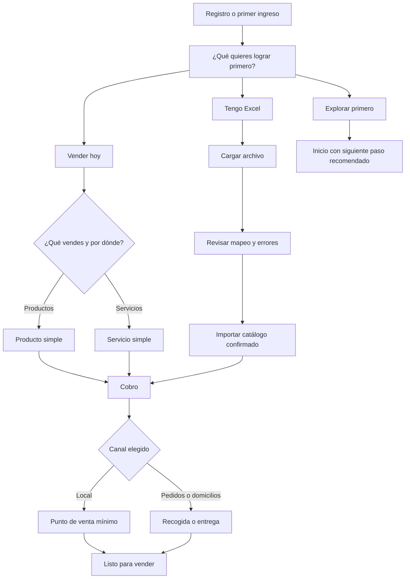

# Onboarding V2: activación para vender

## Decisión de producto

Katuq debe pasar de un wizard de configuración técnica a un acompañamiento que deje a cada empresa con un primer resultado útil.

La promesa es:

> En pocos minutos dejaremos algo listo para vender. Lo demás se configura contigo cuando haga falta.

La métrica principal no será “terminó el onboarding”, sino que la empresa haya llegado a un hito verificable de su ruta: catálogo importado, producto/servicio listo, medio de cobro confirmado o primera venta.

## Estado verificado del onboarding actual

Lo siguiente se comprobó contra el código, no se asume. Fija el punto de partida y explica por qué varias tareas de la base no son “mejoras”, sino correcciones.

| Hallazgo | Evidencia |
|---|---|
| El progreso vive en una sola clave de navegador, sin empresa ni usuario. Cambiar de empresa o de sesión arrastra el progreso anterior. | `onboarding.service.ts`, `STORAGE_KEY = 'katuq_onboarding_state'`. |
| Existen tres conteos distintos de pasos: el modelo define 15, el wizard fija 13 y la verificación de recursos reporta 12. | `onboarding-state.model.ts`, `onboarding-wizard.component.ts`, `loadExistingData`. |
| El porcentaje se calcula sobre 15 pasos aunque solo 12 son obligatorios: el onboarding se declara completo mostrando 80 %. | `calculateProgress` frente a la condición de finalización. |
| Al no encontrar empresa en el navegador, el onboarding consulta por correo y escribe la primera del arreglo como empresa activa. En una cuenta multiempresa cambia el tenant por debajo de la sesión. | `loadExistingData`, escritura de `currentCompany`. |
| El servicio usa `HttpClient` directo y arma sus propios encabezados de empresa en vez de extender `BaseService`. La empresa que envía el onboarding puede diferir de la de la sesión. | Constructor y `getHttpOptions`. |
| Omitir un paso opcional no recalcula el progreso ni sincroniza con el servidor. | `skipStep`. |
| La identidad viaja por correo en la URL y en el cuerpo de las peticiones de progreso. | `/v1/users/onboarding/status`, `save-progress`. |
| La espera de datos de empresa se resuelve con temporizador y diez reintentos. | `waitForCompanyData`. |
| La traza del flujo se hace con mensajes de consola. | Todo el servicio. |

## Trabajo previo obligatorio: cerrar la autenticación

Esto **no forma parte del rediseño** y no debe esperar a él. Son endpoints de onboarding montados hoy sin sesión:

- `POST /v1/onboarding/company` hace inserción o actualización buscando por NIT. Sin sesión, quien conozca un NIT —dato público— puede sobrescribir nombre comercial, correo, teléfono, dirección, ciudad y logo de cualquier empresa.
- El actor que queda registrado en la auditoría se toma de un encabezado que envía el cliente, así que es falsificable.
- Tampoco exigen sesión: `GET /company/check`, `POST /import-products`, `POST /import-customers`, `POST /import-inventory`, `POST /import-categories` y `DELETE /import-customers/:batchId`. El único dato que gobierna la escritura es el nombre de empresa que llega por encabezado.
- El único control de rol es un guard de ruta que lee el rol desde el almacenamiento del navegador. Es cosmético y se altera desde la consola.

Hay precedente idéntico ya resuelto en el mismo archivo de rutas: el borrado masivo de clientes estaba abierto por la misma razón y hoy exige sesión y rol de administrador. Se aplica el mismo criterio a los endpoints anteriores antes de construir cualquier pantalla del V2.

## Alcance y límites

### Objetivos

- Unir registro, primer login, bienvenida y configuración en una sola experiencia.
- Adaptar las tareas a la intención y operación real de cada empresa.
- Permitir a una persona sin conocimiento técnico llegar a una primera venta sin enfrentar términos internos.
- Dar a una empresa que ya tiene Excel una ruta rápida de importación y revisión.
- Mostrar éxito solo cuando el backend confirmó la persistencia y el resultado.
- Mantener aislamiento multiempresa, idempotencia y las reglas críticas de inventario.

### No objetivos de la primera entrega

- Reemplazar todas las pantallas maestras actuales.
- Configurar automáticamente precios, productos, inventario o integraciones sin revisión explícita.
- Obligar facturación electrónica, logística, CRM, roles avanzados o e-commerce para empezar.
- Migrar de forma destructiva datos o progreso de empresas existentes.

## Plomería que se crea sola y nunca se le pregunta al usuario

Hay configuración interna sin la cual la primera venta falla. No es una decisión del comerciante y por eso no aparece como paso, pregunta ni tarea pospuesta: se crea con valores por defecto en el momento en que la empresa queda creada.

**Consecutivos de numeración.** La creación de un pedido pide un consecutivo a la empresa y aborta con “Consecutivo no encontrado” si no existe, tanto para pedidos web como para punto de venta. Si quedaran librados a un paso opcional, el botón “Hacer una venta ahora” fallaría exactamente en el momento de la verdad.

Hoy la cobertura es desigual según cómo nació la empresa:

| Camino | ¿Crea consecutivos? |
|---|---|
| Registro por encuesta | Sí, pero es el sexto de siete pasos de la configuración inicial, y toda esa configuración corre dentro de un bloque que se traga el error. Si algo falla antes —bodegas, canales o sus asociaciones— la empresa y el usuario quedan creados, el correo de bienvenida sale, y los consecutivos no existen. El registro reporta éxito igual. |
| Alta desde el wizard de onboarding | No. Solo aparecen si la persona llega hasta el último paso. |
| Alta de un lead de empresa en el CRM | No, y así debe quedar: esos registros son prospectos del pipeline comercial de Katuq, no empresas que vayan a vender. El consecutivo les corresponde cuando el prospecto se activa como empresa operativa, no al entrar al embudo. |

El V2 los garantiza en los dos caminos que producen una empresa operativa, con una rutina única e idempotente, invocada al quedar creada la empresa y con su propio manejo de error, no colgada del bloque que hoy silencia fallos. Solo se muestran si la persona quiere cambiar el formato.

El valor de empresa que llevan los consecutivos debe ser el mismo que viaja en la sesión: en el registro por encuesta coinciden el nombre de la empresa, su nombre comercial, el campo de empresa del usuario y el de los consecutivos. Cualquier camino nuevo mantiene esa coincidencia o los consecutivos quedan invisibles para la creación del pedido.

La ubicación de inventario sigue otra regla: el descuento de existencias no interrumpe la creación del pedido, así que una empresa sin bodega puede vender. Por eso la bodega sí puede quedar diferida, y los consecutivos no.

Antes de declarar “Listo para vender”, la comprobación de preparación verifica que exista el consecutivo correspondiente al canal elegido.

## Experiencia objetivo



El primer selector tiene tres opciones sencillas:

| Opción | Mensaje | Resultado esperado |
|---|---|---|
| **Vender hoy** | “Crea o agrega algo que vendes y prepárate para cobrar.” | Producto/servicio + cobro + acceso a ventas. |
| **Tengo Excel** | “Trae tus productos, clientes o inventario; tú revisas antes de guardar.” | Importación validada y confirmada. |
| **Explorar primero** | “Conoce Katuq y configura solo cuando lo necesites.” | Inicio funcional y checklist no bloqueante. |

Las rutas no son excluyentes ni definitivas. El diagrama ya muestra que la importación desemboca en cobro, así que una misma empresa puede importar su catálogo y después completar “Vender hoy”. La elección se guarda como la ruta activa, se acumula en el historial de rutas iniciadas y se puede cambiar en cualquier momento sin perder lo hecho.

Las preguntas de canal —local, WhatsApp/redes, pedidos o domicilios— aparecen dentro de la ruta elegida. No se muestran tareas irrelevantes: una empresa de servicios no ve inventario y una venta local no configura domicilios.

## Lenguaje visual: hereda el de las pantallas ya rediseñadas

El V2 **no diseña un look propio**. Toma el de las pantallas nuevas —la lista de pedidos y su familia— porque ya son el tema canónico aprobado, extraído de “Todos los pedidos” por ser la pantalla más cercana al manual de marca.

### De dónde se hereda, y con qué mecanismo

Existe un parcial compartido, `src/app/shared/styles/_katuq-comercial.scss`, que ya usan **veinte pantallas**: lista de pedidos, carrito, checkout, punto de venta y sus widgets, facturación, cartera, tesorería, inventario por bodega, venta asistida. Ese parcial —no una copia de estilos— es la vía de entrada:

```scss
@import '../../../shared/styles/katuq-comercial';
:host { @include kc-tokens; }
```

Trae listos los ladrillos que el onboarding necesita: tarjeta, encabezado de tarjeta con banda, chip de ícono de 38 px, etiqueta en mayúscula apagada, campo de formulario, botón primario y fantasma, píldora de estado, panel, caja de estado vacío y piel de tabla. Construir el V2 con estos mixins es lo que garantiza que se vea como el resto, y evita repetir miles de líneas de estilos.

### El choque de morados, y qué hace el onboarding

Hoy conviven tres morados y no son el mismo:

| Origen | Acento | Situación |
|---|---|---|
| Tema canónico, de la lista de pedidos | `#5F3FE0` | Es el aprobado por la especificación de diseño. |
| Parcial comercial compartido | `#6c4ce0` | Viene del rediseño de cotizaciones; es lo que consumen las veinte pantallas. |
| Archivo de tokens antiguo | `#8b5cf6` | Solo lo importan 20 de 324 hojas de estilo, y sus degradados están dados de baja. |

La reconciliación entre el primero y el tercero está declarada como pendiente y debe resolverse en una propuesta propia, no aquí. El onboarding **no la resuelve ni la esquiva**: importa el parcial compartido y realinea el acento al canónico en su propio ámbito, sin tocar las otras veinte pantallas.

```scss
:host {
  @include kc-tokens;
  --kc-accent: #5F3FE0;
  --kc-accent-ink: #4a2fc0;
  --kc-accent-wash: #efe9ff;
}
```

### Patrones concretos que se heredan

- **Encabezado de pantalla**: título de 20 px, peso 800, en acento; subtítulo de 12,5 px apagado con el dato relevante en negrita.
- **Selector de opciones**: control segmentado —contenedor claro con borde lila, radio 10 px; la opción activa es una pastilla blanca con texto en acento y sombra—. Es la pieza natural para “¿Qué quieres lograr primero?” y para las preguntas de una decisión por pantalla.
- **Resumen del resultado**: fichas planas tintadas, fondo suave, borde lila, radio 10 px, etiqueta en mayúscula arriba y valor de 15–19 px peso 800 en acento. Sirve para “1 producto · Efectivo · Venta desde mi local”.
- **Botones**: primario sólido en acento, texto blanco, radio 11 px, sombra violeta difusa. Secundario blanco con borde claro. “Hacer una venta ahora” es primario; “Ver mis productos” y “Seguir después”, secundarios.
- **Estado vacío**: ícono en azulejo de 64 px, radio 16 px, fondo lila muy claro; título de 15 px peso 800 y subtítulo de 12,5 px apagado. Es la base de las pantallas antes del primer producto.
- **Tarjetas**: radio 20 px, borde claro, sombra tenue. Cada paso es una tarjeta con chip de ícono y encabezado, igual que en cotizaciones.
- **Plano, sin degradados**, y sin el borde izquierdo de acento del patrón viejo.

### Lo que hay que quitar del onboarding actual

La pantalla actual es de las más desalineadas de la aplicación:

- Usa la paleta de **Google Material** —azul `#1a73e8`, grises `#202124` y `#5f6368`, bordes `#dadce0`—. No aparece ni un morado de Katuq.
- Tiene **siete degradados** repartidos en seis hojas de estilo, incluido el mixin móvil compartido del módulo, y el tema canónico los prohíbe.

Ninguno de los dos sobrevive al V2. Quedan igualmente prohibidos los primarios paralelos que compiten en otros módulos: el azul Material, el índigo de crear ventas, el azul del tablero y los morados tipo Polaris de inventarios.

### Un detalle de implementación

La tarjeta persistente de “Continuar: tu siguiente paso” vive en la pantalla de bienvenida, que hoy importa el archivo de tokens antiguo. Esa tarjeta se construye con el parcial compartido y el acento canónico, para que no quede un morado distinto al lado del otro dentro de la misma pantalla.

## Pantallas y microcopy

### 1. Bienvenida de activación

**Título:** “Vamos a dejarte algo listo para vender.”

**Apoyo:** “No necesitas saber de inventarios, bodegas ni facturas. Te explicamos paso a paso y puedes continuar después.”

Debe aparecer después del registro y también desde una tarjeta persistente de `welcome` para empresas que aún tienen un hito pendiente. La tarjeta dice “Continuar: tu siguiente paso” y nunca se oculta de forma definitiva al cerrarla.

### 2. Elegir el primer objetivo

**Título:** “¿Qué quieres lograr primero?”

Cada opción explica el resultado, no una función del sistema. La elección se guarda inmediatamente y es reversible.

### 3. Entender el negocio, sin jerga

Preguntas de una decisión por pantalla:

- “¿Qué vendes?”: Productos, servicios, ambos, todavía lo estoy definiendo.
- “¿Dónde te encuentran tus clientes?”: En mi local, por WhatsApp o redes, a domicilio, todavía no vendo.
- “¿Quieres llevar la cuenta de cuántas unidades te quedan?”: Sí, no por ahora.

Siempre existe “No estoy seguro todavía” y un texto corto de por qué se pregunta.

### 4. Primer producto o servicio

**Título:** “Empecemos con una cosa que vendes.”

Campos iniciales:

- Nombre.
- Precio de venta.
- Foto opcional.

Ejemplos: “Corte de cabello” o “Camiseta blanca”. No se solicitan SKU, categoría, costo, impuesto, código de barras, descripción o foto para llegar al primer hito. Si no hay precio, se permite un borrador, pero no se declara que la empresa está lista para vender.

Para productos físicos que activaron inventario, se pregunta “¿Dónde los guardas?” y luego “¿Cuántos tienes hoy?”. La interfaz puede aclarar en ayuda que Katuq llama a ese lugar “bodega”, pero no debe iniciar con ese término.

### 5. Cobro y canal mínimo

**Título:** “¿Cómo recibes el dinero de tus ventas?”

Opciones: efectivo, transferencia, tarjeta/enlace o “aún no recibo pagos”. Los datos bancarios, integraciones y configuraciones de correo quedan para después.

Luego se muestra solo la decisión necesaria del canal:

- Local: punto de venta mínimo y ubicación opcional.
- Pedidos/domicilios: recogida en tienda, entrega propia o transportadora.
- WhatsApp/redes: registro de pedidos sin logística obligatoria.

No se piden tarifas, horarios, coordenadas, facturación o integraciones para esta primera activación. El consecutivo del canal ya existe porque se creó solo.

### 6. Resultado real

**Título:** “¡Listo! Ya puedes registrar una venta.”

Ejemplo de resumen: “1 producto · Efectivo · Venta desde mi local”.

Acciones:

- Primaria: “Hacer una venta ahora”.
- Secundarias: “Ver mis productos” y “Seguir después”.

El resultado se calcula desde recursos confirmados; no desde pasos navegados ni estado local.

## Ruta de importación para empresas con Excel

| Pantalla | Resultado y regla |
|---|---|
| Carga | “Aceptamos Excel y CSV. Katuq leerá el archivo y tú revisas todo antes de guardarlo.” La plantilla descargada debe poder cargarse de vuelta. |
| Mapeo | Nombre y precio son mínimos para producto. Referencia, costo, categoría y foto son opcionales. KAI sugiere; la persona confirma. |
| Validación | Mostrar filas listas, filas con problemas y la acción elegida. Nunca importar parcialmente en silencio. |
| Cantidades detectadas | En la primera entrega, si el archivo trae unidades se avisa que se conservan como pendiente y **no se escribe inventario**. Se ofrece activar el control de existencias después. |
| Revisión | Decir exactamente qué se creará y permitir volver a editar antes de aplicar. |
| Resultado | “Tu catálogo está listo” con acción relevante: registrar venta, ver catálogo o importar clientes. |

La importación de productos, clientes e inventario son procesos separados. Inventario no debe crear ni corregir productos, precios, listas de precios, imágenes ni catálogo.

La primera entrega **no importa inventario**: su contrato se valida aparte, y hasta entonces el hito “listo con inventario” no está disponible por esta ruta.

## Criterios de completitud

Los hitos no son excluyentes: una empresa acumula los que va alcanzando. “Pausado” no es un hito sino una marca aparte, y no equivale a completado.

| Hito | Condición verificable |
|---|---|
| `product_ready` | Producto o servicio activo con nombre y precio. |
| `payment_ready` | Al menos una forma de cobro confirmada. |
| `ready_to_sell` | `product_ready` + `payment_ready` + consecutivo del canal existente. |
| `inventory_ready` | `ready_to_sell` + ubicación principal y cantidad, solo si la empresa activó control de existencias. |
| `orders_ready` | `ready_to_sell` + una opción de recogida o entrega. |
| `catalog_imported` | Archivo confirmado, mapeo válido y lote aplicado; errores visibles como pendientes. |
| `first_sale` | Venta persistida y confirmada por el sistema. |

Configuraciones que permanecen opcionales al inicio: logo, información tributaria detallada, categorías, SKU, costos, impuestos, múltiples bodegas, horarios, tarifas, transportadoras, usuarios, permisos, CRM, automatizaciones, e-commerce, listas de precios, integraciones y facturación electrónica. Los consecutivos salen de esta lista: se crean solos.

## Arquitectura V2

### Estado canónico de empresa

El backend será la fuente de verdad. El estado se asocia a `companyId`, no a un correo ni a una clave genérica del navegador.

```ts
interface CompanyOnboarding {
  companyId: string;
  schemaVersion: 'v2';
  activeRoute: 'sell_today' | 'import_excel' | 'explore';
  routesStarted: Array<'sell_today' | 'import_excel' | 'explore'>;
  context: {
    offering?: 'products' | 'services' | 'both' | 'unknown';
    channels?: Array<'local' | 'social' | 'delivery' | 'unknown'>;
    inventoryEnabled?: boolean;
  };
  tasks: Array<{
    id: TaskId;                 // catálogo cerrado, no cadena libre
    applicable: boolean;        // lo decide el motor de rutas, no la pantalla
    status: 'pending' | 'in_progress' | 'completed' | 'skipped';
    resourceRefs: string[];
    idempotencyKey?: string;    // persistida antes de enviar el comando
    lastErrorCode?: string;
  }>;
  milestones: Array<
    | 'product_ready'
    | 'payment_ready'
    | 'ready_to_sell'
    | 'inventory_ready'
    | 'orders_ready'
    | 'catalog_imported'
    | 'first_sale'
  >;
  pausedAt?: string;
  updatedAt: string;
}
```

El progreso se calcula solo sobre las tareas con `applicable: true`. No existe un total fijo de pasos: el denominador cambia con la ruta y el contexto, y es la única cifra que puede mostrarse en pantalla.

El estado personal se separa y se limita a `companyId + userId + schemaVersion`: última pantalla, ayuda vista y borradores sin confirmar. Al cambiar de empresa o cerrar sesión, no se reutiliza un borrador de otro contexto.

### Reglas de seguridad y persistencia

- El backend deriva actor, empresa y permisos desde sesión/JWT y membresía. Un `email` o encabezado de empresa enviado por el cliente nunca es autoridad.
- Solo administradores autorizados ejecutan tareas administrativas, y esa verificación ocurre en el servidor. El guard de ruta es apenas comodidad visual.
- Cada comando de escritura usa `idempotencyKey`, responde con estado y `resourceRefs`, y no duplica recursos ante reintentos o dos pestañas.
- La clave de idempotencia se deriva de `companyId + taskId + huella del contenido confirmado` y **se persiste en el estado antes de enviar el comando**. Si se generara en memoria, un refresco la perdería y no protegería justamente el caso que debe cubrir.
- La interfaz solo dice “Guardado” o “Listo” después de una respuesta confirmada del backend.
- Las operaciones que requieren consistencia usan transacciones Firestore; los errores conservan la tarea pendiente y recuperable.
- Telemetría y auditoría se registran de forma estructurada, nunca con mensajes de consola.
- El frontend encapsula HTTP en servicios que extienden `BaseService`; ningún componente ni servicio de onboarding usa `HttpClient` directo ni arma encabezados de empresa por su cuenta.
- El onboarding **nunca** escribe la empresa activa de la sesión. Si necesita saber cuál es, la pide al servicio de seguridad; si hay varias y ninguna activa, pregunta.

### Convivencia con el onboarding actual

- El V2 se enciende con bandera por empresa. La bandera vive junto a la configuración de la empresa en el backend y solo la cambia un administrador de Katuq; el frontend la lee, no la decide.
- Mientras exista la bandera, el wizard actual no se monta para esa empresa. Dos wizards activos escribiendo el mismo progreso es la causa raíz de la mitad de los problemas de hoy.
- **Lectura de compatibilidad, sin migración:** al activar el V2, el estado se reconstruye consultando los recursos reales de la empresa —producto, cobro, entrega, consecutivo, catálogo, primera venta— y de ahí se derivan los hitos. El progreso viejo del navegador y el guardado por correo se ignoran; no se borran ni se convierten.
- Apagar la bandera devuelve a la empresa al flujo actual sin pérdida, porque el V2 nunca destruye el estado anterior.

### Límites de inventario

La primera entrega vertical no incluye importación de inventario hasta validar su contrato específico. Cuando se habilite:

- `idBodega` usa el business code, nunca el Firestore document ID.
- El flujo de stock normaliza referencia de producto a document ID y deduplica por producto+bodega antes de totalizar.
- Si no se resuelve un producto, se reporta y omite; no se crea desde inventario.
- El write-set se limita a inventario, movimientos, idempotencia/auditoría e `InventoryLevel` autorizado. No modifica productos, precios, listas, imágenes ni catálogo.
- Cualquier publicación a Shopify es un flujo stock-only, con bandera por empresa y kill switch independiente.

### KAI

KAI puede explicar una recomendación o sugerir mapeos mediante flujos Genkit, pero no puede mutar recursos sin confirmación. El mensaje debe mostrar causa y efecto:

> “Dejamos Efectivo porque elegiste venta en local. Puedes cambiarlo ahora o después.”

Nunca se presentan estructuras JSON al usuario ni se denomina “IA personalizada” a una regla fija.

## Backlog priorizado

### Fase 0 — trabajo previo, independiente del rediseño

| Trabajo | Criterio de aceptación |
|---|---|
| Exigir sesión en los endpoints de onboarding e importación hoy abiertos, y derivar empresa y actor del token. | Sin token responden 401; con token de la empresa A no se escribe en la B; la web y las apps siguen funcionando. |
| Garantizar consecutivos en los dos caminos que producen una empresa operativa, con una rutina única e idempotente. | Una empresa recién creada por cualquiera de los dos caminos registra una venta web y una de punto de venta sin configurar nada; repetir el alta no duplica consecutivos; un fallo de la configuración inicial ya no la deja sin numeración en silencio. |

### Fase 1 — base segura y consistente

| Trabajo | Criterio de aceptación |
|---|---|
| Estado canónico por empresa, con catálogo cerrado de tareas y motor que marca cuáles aplican. | Progreso y porcentaje se calculan sobre tareas aplicables; no aparece ningún total fijo de pasos ni cuentas contradictorias. |
| Validar membresía y rol en el servidor para cada comando. | Un administrador de A no lee ni escribe estado o recursos de B; un vendedor no ejecuta tareas administrativas. |
| Unificar los comandos de cada tarea y sus DTOs; eliminar la doble escritura entre componente y orquestador. | Repetir la misma solicitud crea exactamente un recurso y no hay éxito falso. |
| Idempotencia persistida, transacciones y auditoría por comando. | Refrescar, doble clic o dos pestañas no duplican bodegas, pagos, roles, productos ni lotes. |
| Corregir los bloqueadores verificados: clave de estado compartida, conteos 15/13/12, finalización, cargas y la escritura de empresa activa. | Pruebas de contrato y de extremo a extremo cubren contador, reanudación, fallo de red, finalización y cuenta multiempresa. |
| Bandera por empresa, kill switch y convivencia con el flujo actual. | El flujo actual no cambia para empresas sin bandera y el V2 se revierte sin migraciones destructivas. |

El motor de rutas se adelanta a esta fase a propósito: es lo que define qué tareas aplican, y sin él el porcentaje no tiene denominador.

### Fase 2 — primera entrega de valor

| Trabajo | Criterio de aceptación |
|---|---|
| Pantallas de la ruta “Vender hoy”, construidas sobre el parcial visual compartido. | Empresa autenticada puede crear producto/servicio, confirmar cobro y abrir ventas, y la venta se registra sin error de consecutivo. Ninguna hoja de estilo del módulo declara colores propios, degradados ni primarios paralelos: todo sale de los mixins compartidos y del acento canónico. |
| Unificar registro, login, bienvenida y reanudación. | Datos ya entregados no se solicitan otra vez; la tarjeta abre siempre el V2 y muestra el siguiente hito. |
| Importación por lote: `uploaded → mapped → validated → confirmed → applied/failed`. | El usuario ve errores, edita mapeos y confirma antes de aplicar; las cantidades detectadas quedan como pendiente sin escribir inventario. |
| Plantillas revisables por ruta y sector. | No se crean roles, categorías, pagos ni entregas sin confirmación. |
| Instrumentar embudo y auditoría de producto. | Eventos sin datos personales innecesarios y con empresa, ruta, tarea, versión y resultado. |

### Fase 3 — acompañamiento continuo

| Trabajo | Criterio de aceptación |
|---|---|
| Checklist posterior de recomendaciones y tareas avanzadas. | No bloquea ventas y respeta la posposición. |
| Asistente KAI contextual y ayuda humana. | Explica recomendaciones, permite editarlas y no expone credenciales ni datos de otras empresas. |
| Experimentos de copy, orden y plantillas por bandera. | Cohortes comparables y reversión inmediata. |

## Validación y lanzamiento

### Investigación antes de construir todo

1. Medir una línea base del flujo actual durante una o dos semanas.
2. Entrevistar a 6–8 comerciantes sobre su operación y el vocabulario que usan.
3. Probar el prototipo con 12–16 personas: 6–8 principiantes, 4–5 usuarios de Excel/redes y 4–5 expertos. Incluir por lo menos cuatro participantes móviles y uno con conectividad limitada.
4. Ejecutar piloto por empresa bajo bandera; comparar cohortes por empresa, nunca por usuario.

Tareas de prueba:

- “Vendes pocos productos por WhatsApp: déjalo listo para registrar una venta mañana.”
- “Tienes un Excel con nombre, referencia, precio y unidades: impórtalo y corrige una sugerencia.”
- “Tienes un local y recibes efectivo/tarjeta: configura solo lo indispensable.”
- “Pausa a la mitad y vuelve después.”

### Eventos mínimos

Catálogo cerrado, sin comodines, para que el embudo sea consultable:

`onboarding_started`, `onboarding_resumed`, `onboarding_route_selected`, `onboarding_step_viewed`, `onboarding_step_completed`, `onboarding_step_skipped`, `onboarding_save_succeeded`, `onboarding_save_failed`, `catalog_import_uploaded`, `catalog_import_mapped`, `catalog_import_validated`, `catalog_import_confirmed`, `catalog_import_applied`, `catalog_import_failed`, `catalog_item_created`, `payment_method_configured`, `readiness_evaluated`, `readiness_milestone_reached`, `readiness_blocked`, `sales_workspace_opened`, `first_order_created`, `onboarding_support_requested`.

Todos los eventos de guardado, importación y primera venta se confirman desde backend. No se almacenan teléfonos, correos, contenido de Excel ni nombres de productos en la analítica de embudo.

### Condiciones para avanzar

- En prototipo: al menos 80 % entiende y escoge una ruta adecuada; 75 % de principiantes completa la tarea central sin ayuda; ningún error crítico de configuración.
- En piloto: mejorar al menos 15 puntos porcentuales el primer hito dentro de 24 horas frente a la línea base, sin aumentar fallos de guardado, soporte o configuraciones inválidas. Si el volumen de empresas nuevas no alcanza para distinguir esa diferencia, el criterio de avance pasa a ser cualitativo —sin errores críticos y con tareas completadas sin ayuda— y se declara así de forma explícita en vez de forzar una lectura estadística que los datos no soportan.
- En escalamiento: mejorar “listo para vender” a 7 días y primera venta a 7/30 días, sin ampliar la brecha entre principiantes y expertos.

## Secuencia de entrega recomendada

1. Cerrar la autenticación de los endpoints abiertos y crear consecutivos por defecto.
2. Base segura completa y pruebas en staging con dos empresas independientes.
3. Ruta vertical limitada: empresa autenticada → objetivo → producto/servicio → cobro → ventas.
4. Piloto con bandera y observabilidad.
5. Ruta de Excel por lote, sin inventario.
6. Rutas de local y pedidos/domicilios.
7. Checklist avanzado, ayuda contextual y experimentación.

La regla de lanzamiento es simple: no se aprueba porque más personas presionen “Finalizar”; se aprueba cuando más empresas llegan de forma segura y comprensible a vender.
