# Manual de Usuario — Configuración de Usuarios y Reportes

Guía paso a paso para administradores de Katuq.
Cubre cómo crear usuarios, asignarles roles, configurar pantallas de bienvenida, y cómo el equipo usa el Constructor de Reportes.

> **Audiencia:** administrador de la empresa.
> **Versión Katuq:** 2026.05.24.8+ (mayo 2026)

---

## Índice

1. [Conceptos básicos](#1-conceptos-básicos)
2. [Crear y editar usuarios](#2-crear-y-editar-usuarios)
3. [Roles y permisos](#3-roles-y-permisos)
4. [Pantalla de bienvenida personalizada](#4-pantalla-de-bienvenida-personalizada)
5. [Constructor de Reportes (Report Builder)](#5-constructor-de-reportes)
6. [Ver un reporte guardado](#6-ver-un-reporte-guardado)
7. [Preguntas frecuentes](#7-preguntas-frecuentes)

---

## 1. Conceptos básicos

Antes de empezar, te conviene tener claros tres conceptos.

### 1.1 Usuario

Una persona con credenciales para entrar a Katuq. Tiene email, contraseña, datos personales y **un rol asignado**.

### 1.2 Rol

Define **qué puede ver y hacer** el usuario. Ejemplos típicos:

- **Administrador**: ve todo, gestiona usuarios y empresa.
- **Vendedor**: crea pedidos, ve sus clientes y sus ventas.
- **Cajero**: usa el POS, no edita productos.
- **Bodeguero**: gestiona inventario y despachos.
- **Contador**: ve reportes contables, no edita ventas.

Un rol agrupa dos cosas:

1. **Los menús** que el usuario verá en la barra lateral.
2. **Los permisos** específicos (ver / crear / editar / eliminar) por cada módulo.

### 1.3 Reporte

Una consulta guardada en el Constructor de Reportes. Tiene una fuente de datos (Pedidos, Documentos contables, etc.), dimensiones, medidas y filtros. Se puede ejecutar varias veces, exportar y compartir.

---

## 2. Crear y editar usuarios

### 2.1 Acceder al maestro de usuarios

Desde el menú lateral: **Configuración → Seguridad → Usuarios**.

### 2.2 Listado de usuarios

Vas a ver la lista de todos los usuarios de tu empresa, con columnas: Identificación, Nombres, Apellidos, Email, Empresa, Rol, Activo, Acciones.

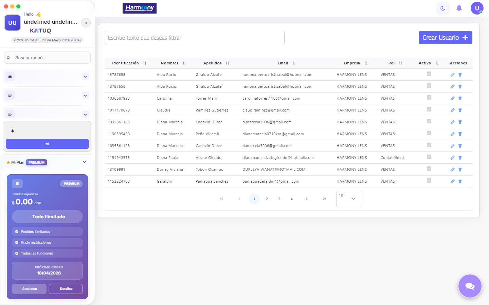

Acciones disponibles:

- **🔍 Buscar**: filtro de texto arriba a la izquierda.
- **➕ Crear Usuario**: botón arriba a la derecha.
- **✏ Editar**: icono lápiz en la columna Acciones.
- **🗑 Eliminar**: icono basurero en la columna Acciones.

### 2.3 Crear un nuevo usuario

Click en **"Crear Usuario"** → te lleva al formulario.

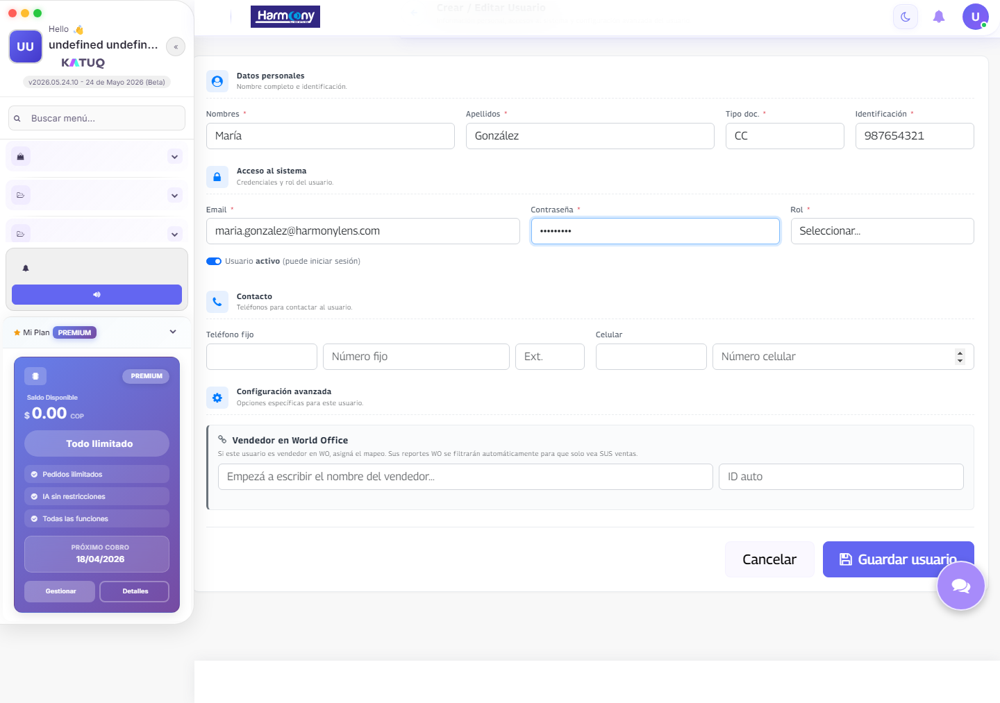

El formulario tiene **4 secciones**:

#### Sección 1: Datos personales

| Campo | Requerido | Ejemplo |
|---|---|---|
| Nombres | Sí | Juan Carlos |
| Apellidos | Sí | Pérez García |
| Tipo de documento | Sí | CC |
| Identificación | Sí | 1234567890 |

#### Sección 2: Acceso al sistema

| Campo | Requerido | Notas |
|---|---|---|
| Email | Sí | Será el usuario para login |
| Contraseña | Sí al crear, opcional al editar | Si editás, dejala vacía para no cambiarla |
| Rol | Sí | Elegí de la lista |
| Activo (switch) | — | Si está apagado, el usuario no puede entrar |

#### Sección 3: Contacto

Todos los campos son **opcionales**:

- Teléfono fijo + extensión + indicativo
- Celular + indicativo país

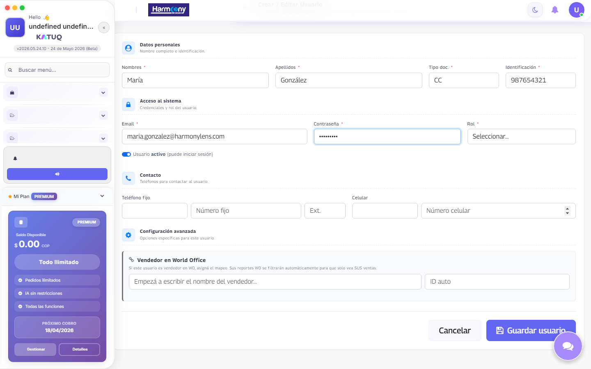

#### Sección 4: Configuración avanzada

Aparece **solo si aplica**:

- **Vendedor en World Office** (si la empresa tiene integración WO activa)
- **Pantalla de bienvenida** (si el rol elegido **no es** Administrador)

Ver detalle en [§4](#4-pantalla-de-bienvenida-personalizada) y [§2.4](#24-asignar-un-vendedor-de-world-office).

#### Guardar

Click en **"Guardar usuario"** abajo a la derecha. Si falta algún dato crítico, te dice exactamente cuál.

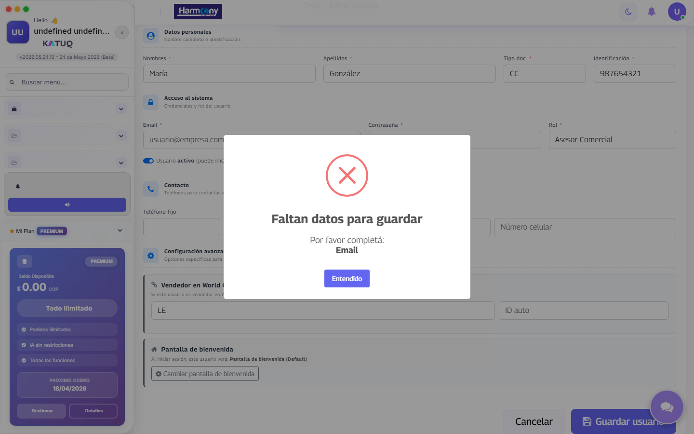

### 2.4 Asignar un vendedor de World Office

> Esta sección solo aparece si la empresa tiene la integración World Office activa.

Si el usuario es un **vendedor real de WO** (tiene sus propios pedidos), asignale el mapeo:

1. Empezá a escribir el nombre del vendedor.
2. El dropdown autocompleta con los vendedores reales de WO de tu empresa.
3. Click → el **ID WO** se llena solo.
4. Guardá.

**Resultado**: cuando ese usuario entre al Constructor de Reportes y consulte Documentos contables WO, **automáticamente solo verá sus ventas** — el filtro se aplica server-side. Ningún otro vendedor le va a aparecer.

---

## 3. Roles y permisos

### 3.1 Acceder al maestro de roles

Desde el menú lateral: **Configuración → Seguridad → Roles y permisos**.

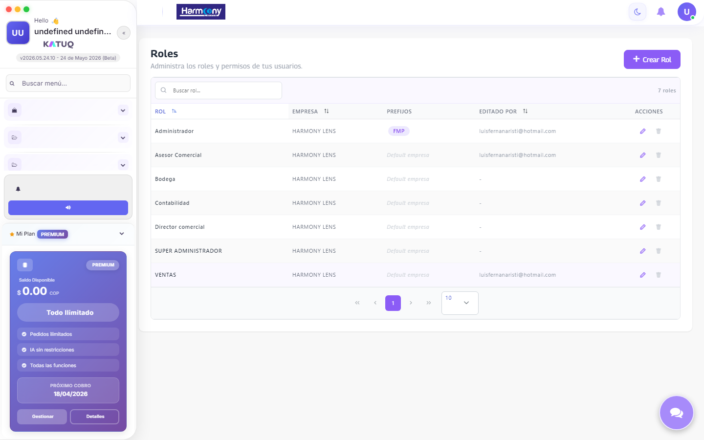

### 3.2 Crear un rol desde plantilla

Cuando creás un rol nuevo aparece un banner morado:

> **¿Querés empezar más rápido?** Elegí una plantilla (Administrador, Vendedor, Cajero, Bodeguero, etc.) y armá un rol con permisos pre-configurados.

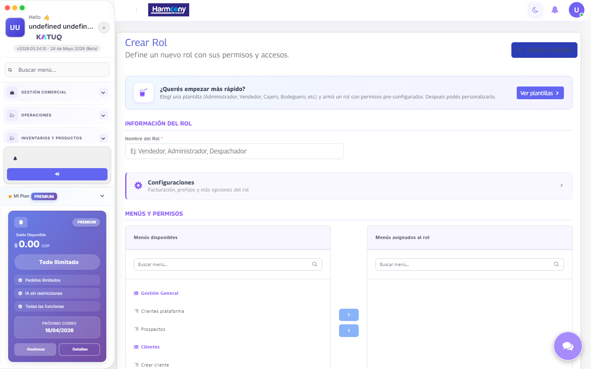

Click → modal con 6 plantillas:

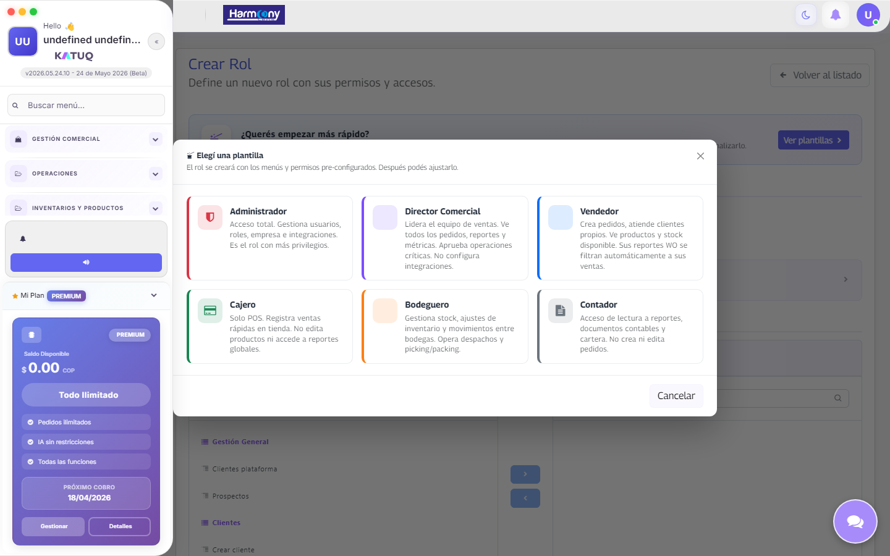

| Plantilla | Para quién es |
|---|---|
| 🛡 **Administrador** | Dueño / encargado general. Ve todo, gestiona empresa, usuarios e integraciones. |
| 📈 **Director Comercial** | Líder del equipo de ventas. Ve todos los pedidos, reportes y métricas. Aprueba operaciones críticas. |
| 👤 **Vendedor** | Crea pedidos, atiende sus clientes. Sus reportes WO se filtran automáticamente a sus ventas. |
| 💳 **Cajero** | Solo POS. Registra ventas rápidas en tienda. |
| 📦 **Bodeguero** | Inventario, ajustes, despachos, picking/packing. |
| 📄 **Contador** | Solo lectura: reportes, documentos contables, cartera. |

Click sobre una card → el formulario se llena automáticamente con:

- Nombre sugerido (lo podés cambiar)
- Menús pre-seleccionados (los podés ajustar)
- Permisos por módulo (los podés ajustar)

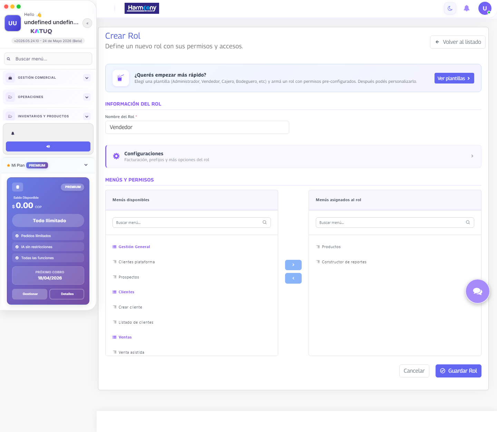

### 3.3 Personalizar un rol

Después de aplicar la plantilla (o desde cero), podés:

1. Cambiar el nombre del rol.
2. Mover menús entre **disponibles** y **asignados** con el pickList del medio.
3. Configurar prefijo de facturación y otras opciones avanzadas (botón ⚙ Configuraciones).
4. Guardar.

### 3.4 Editar un rol existente

Click en el rol del listado → te lleva al formulario con los datos cargados. Los cambios afectan a **todos los usuarios** que tengan ese rol asignado.

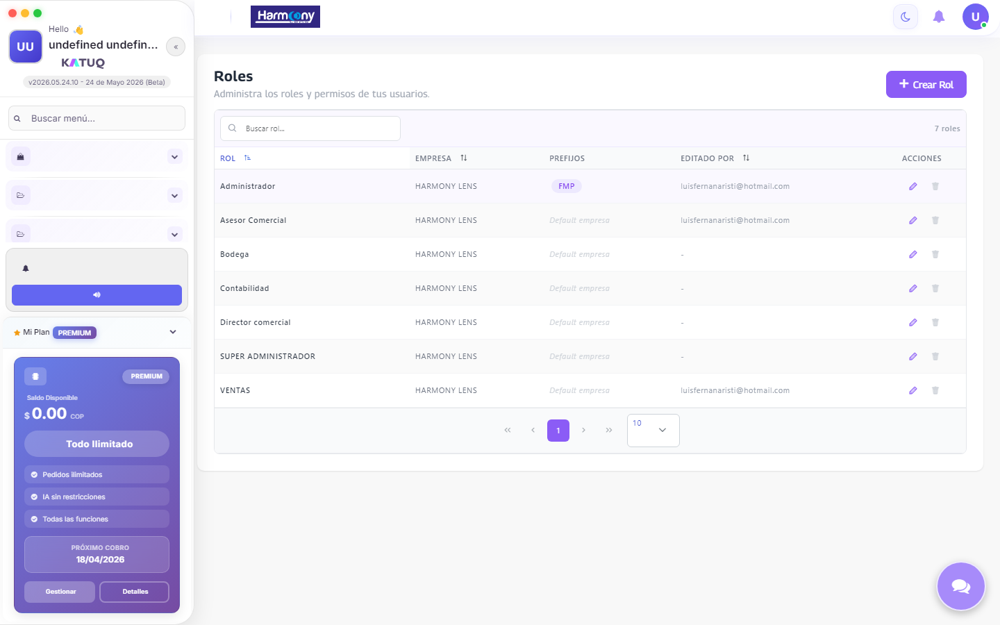

> ⚠ Importante: si quitás un menú de un rol, los usuarios con ese rol **no van a ver más esa opción**. Si ya estaban dentro de esa pantalla, el sistema los redirige.

---

## 4. Pantalla de bienvenida personalizada

Por defecto, al iniciar sesión todos los usuarios entran a la **pantalla de bienvenida** (`/welcome`) con accesos rápidos y resumen del día.

Para roles **distintos de Administrador**, podés cambiar a dónde entra el usuario al loguearse — por ejemplo, llevar a un vendedor directo a su reporte de ventas del mes.

### 4.1 Configurar la pantalla de bienvenida

1. En el formulario del usuario, scroll hasta **Configuración avanzada**.
2. En la sección "Pantalla de bienvenida", click en **"Cambiar pantalla de bienvenida"**.

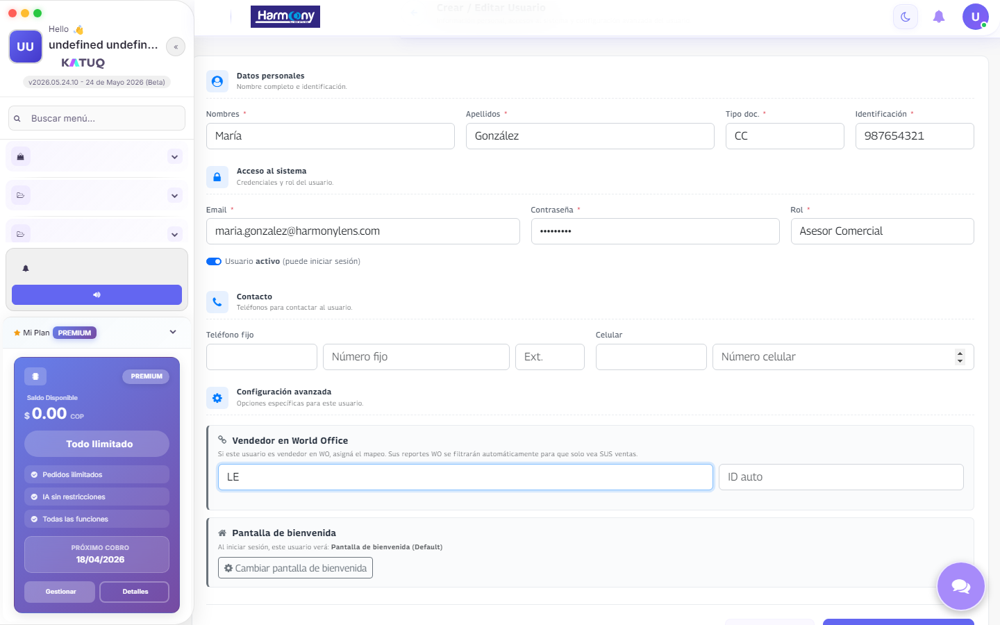

3. Se abre un modal con 3 opciones:

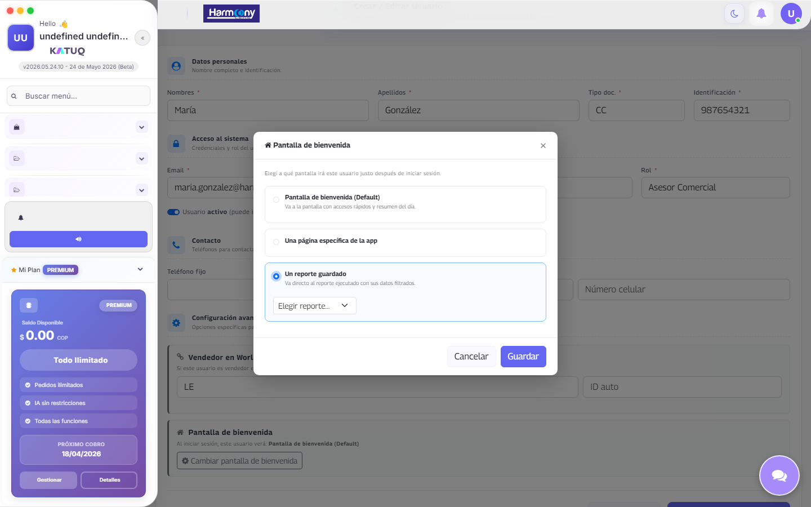

| Opción | Cuándo usar |
|---|---|
| **Pantalla de bienvenida (Default)** | Lo normal — accesos rápidos. |
| **Una página específica de la app** | El usuario hace siempre lo mismo: ej, cajero → POS, bodeguero → Inventario. |
| **Un reporte guardado** | El usuario es un vendedor que necesita ver sus métricas al entrar. |

4. Elegí, configurá y Guardá el modal.
5. Guardá el usuario.

### 4.2 Páginas disponibles

Al elegir "Una página específica", el dropdown muestra:

- Pedidos · POS · Productos · Inventario · Clientes
- Despachos · Picking · Packing
- Dashboard gerencial · Constructor de reportes

### 4.3 Reporte como pantalla de bienvenida

Si elegís "Un reporte guardado":

1. El dropdown lista todos los reportes guardados de tu empresa.
2. Al elegir uno, el usuario al loguearse **entra directo a la vista ejecutada** del reporte (no al constructor — el constructor es para crear/editar).
3. Los datos del reporte **se filtran automáticamente al usuario** si tiene mapeo de vendedor WO.

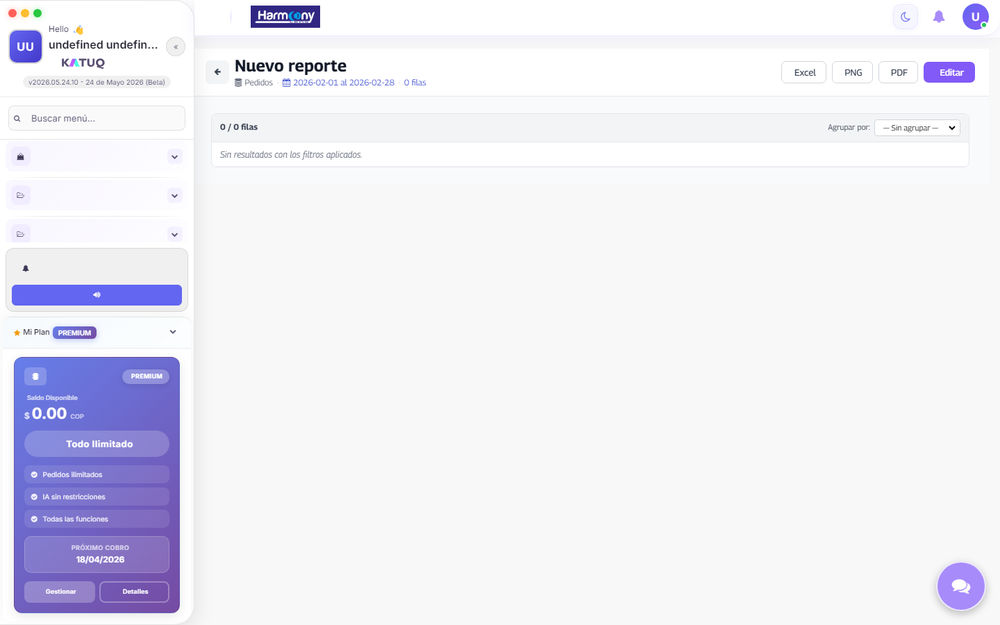

---

## 5. Constructor de Reportes

### 5.1 Acceder al builder

Desde el menú lateral: **Inteligencia de Negocios → Constructor de reportes**, o yendo a `/dashboards/builder`.

### 5.2 Flujo básico

#### Paso 1 — Elegir la fuente de datos

Arriba a la izquierda, dropdown **"Fuente de datos"**. Opciones (dependen de tus integraciones activas):

| Fuente | Qué contiene |
|---|---|
| **Pedidos** | Tus pedidos de Katuq (e-commerce + POS), con totales, canal, estado. |
| **Productos** | Catálogo, precios, stock, marcas. |
| **Inventario** | Stock por bodega, movimientos. |
| **Clientes** | Base de clientes. |
| **Documentos contables (WO)** | Facturas, notas crédito/débito, recibos — desde World Office. |
| **Cartera (CxC / CxP)** | Saldos por tercero — desde World Office. |

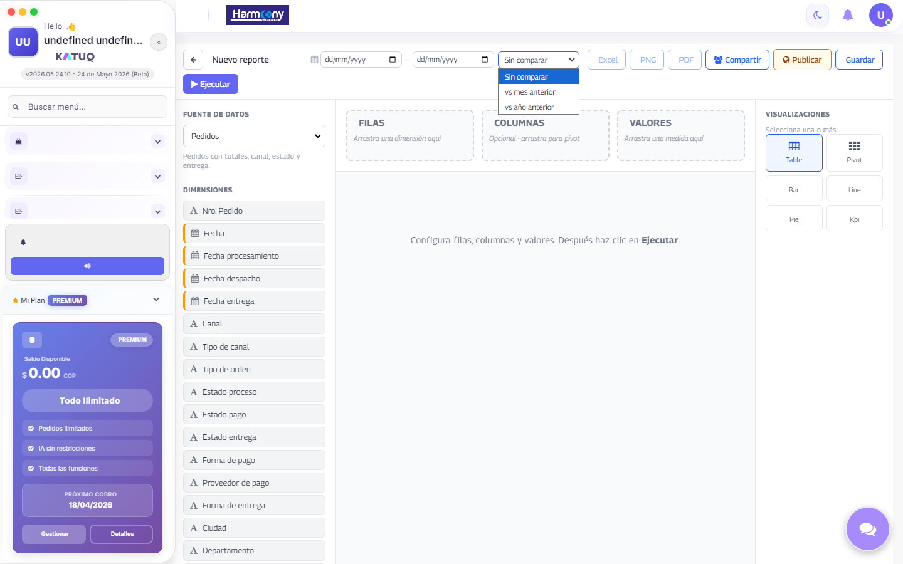

> 💡 Si sos vendedor (rol Vendedor / Asesor Comercial), solo verás **Pedidos** y **Documentos contables** — el resto de fuentes están filtradas automáticamente por seguridad.

#### Paso 2 — Arrastrar dimensiones y medidas

Tres zonas al centro de la pantalla:

- **FILAS** → arrastrá ahí las dimensiones por las que querés agrupar (ej: vendedor, fecha, cliente).
- **COLUMNAS** → opcional, para pivot.
- **VALORES** → arrastrá las medidas que querés calcular (ej: total, cantidad de pedidos).

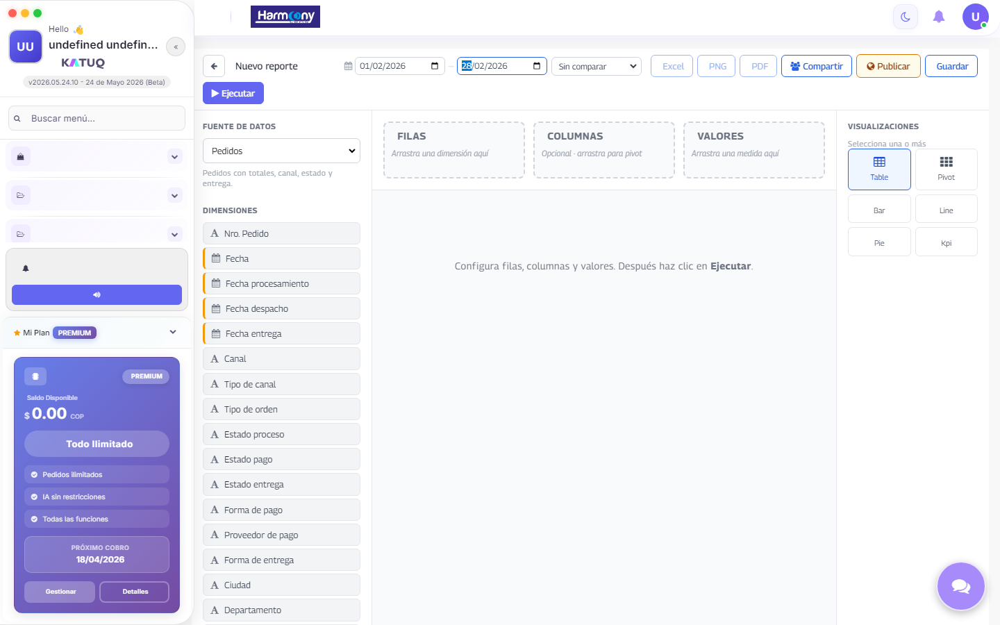

#### Paso 3 — (Opcional) Filtrar por fecha

Arriba al lado del título, dos campos de fecha **"Desde"** y **"Hasta"**. Si los llenás, el reporte solo trae datos del rango.

#### Paso 4 — Ejecutar

Click en **"▶ Ejecutar"** arriba a la derecha. La tabla aparece al centro.

#### Paso 5 — Cambiar visualización

A la derecha hay 6 íconos: **Tabla · Pivot · Bar · Line · Pie · KPI**. Click → la tabla se transforma.

### 5.3 Guardar un reporte

Click en **"Guardar"** arriba a la derecha → te pide nombre y descripción.

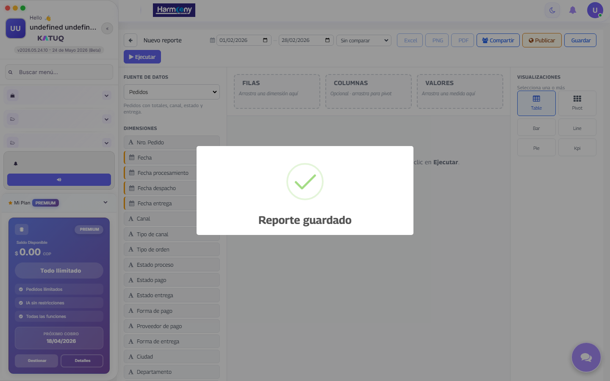

Los reportes guardados quedan accesibles para tu empresa desde `/dashboards`.

### 5.4 Compartir y publicar

- **Compartir**: copia un link interno para que otro usuario lo abra (necesita login).
- **Publicar**: genera un link público para ver el reporte sin login. Ojo: cualquiera con el link puede verlo.

### 5.5 Exportar

Botones arriba a la derecha: **Excel · PNG · PDF**.

### 5.6 Para vendedores: filtro automático

Si el usuario tiene rol Vendedor / Asesor Comercial, en la parte de arriba aparece un banner verde:

> 👤 **Estás viendo solo tus ventas.** Los pedidos y facturas de otros vendedores no aparecen en este reporte.

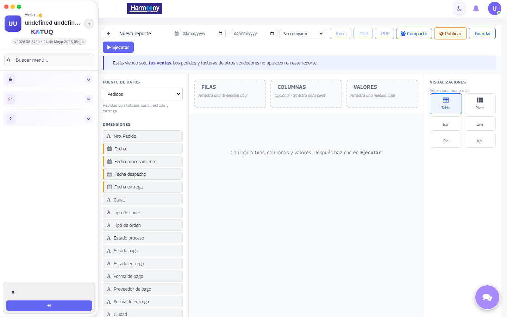

El vendedor puede crear reportes libremente — pero los datos siempre van a estar filtrados a sus pedidos / sus facturas.

---

## 6. Ver un reporte guardado

### 6.1 Desde el dashboard

Ruta: `/dashboards`. Vas a ver las cards de reportes guardados de tu empresa.

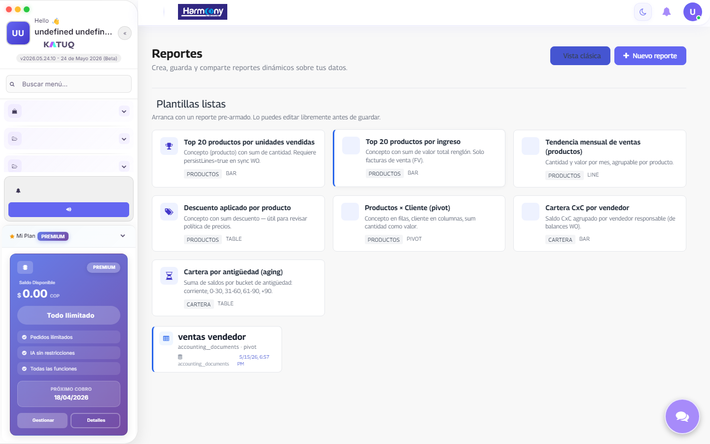

Click en una card → te lleva a `/dashboards/view/:id` con el reporte ejecutado.

### 6.2 Vista previa ejecutada

Esta es la vista **de solo lectura**, NO el constructor:

- No tiene drag-and-drop ni panel de fuentes.
- Muestra directamente la tabla / gráfico con los datos.
- Permite cambiar el rango de fechas y re-ejecutar.
- Permite exportar.
- Si el usuario es vendedor, los datos se filtran automáticamente a sus ventas.

---

## 7. Preguntas frecuentes

### ¿Puedo borrar un rol que tiene usuarios asignados?

Sí, pero los usuarios con ese rol quedan sin permisos hasta que les asignes otro. Es mejor primero mover los usuarios a otro rol y después borrar.

### Un vendedor no ve nada en sus reportes

Verificá que tenga el **mapeo de vendedor WO** configurado (ver [§2.4](#24-asignar-un-vendedor-de-world-office)). Sin mapeo, el filtro server-side bloquea todo (0 resultados, política estricta).

### ¿Cómo cambio la contraseña de un usuario sin saber la actual?

Como Administrador, abrí el usuario en edición, escribí una nueva contraseña en el campo y guardá. Si dejás el campo vacío, **no se modifica** la contraseña actual.

### Un usuario reporta que "no le aparece la opción X en el menú"

Su rol no tiene ese menú asignado. Andá a **Roles y permisos**, abrí el rol, agregá el menú del pickList izquierdo al derecho y guardá. El cambio aplica al próximo login del usuario.

### ¿Por qué el vendedor no ve "Productos" o "Cartera" en el Constructor de Reportes?

Por seguridad. Las fuentes de datos sin filtro por vendedor (Productos, Inventario, Clientes, Cartera, etc.) se ocultan automáticamente para roles vendedor. Solo ve Pedidos y Documentos contables, donde el filtro server-side garantiza que vea solo sus ventas.

### ¿Puedo asignar un reporte como pantalla de inicio del Administrador?

No. La pantalla de bienvenida personalizada **solo se configura para roles no-administrador**. El admin siempre entra a `/welcome` con los accesos rápidos y el onboarding.

### ¿Qué pasa si elimino un reporte que está asignado como pantalla de bienvenida de un usuario?

El usuario al loguearse va a recibir un error o quedar en una pantalla vacía. Antes de eliminar un reporte usado como bienvenida, cambiá la configuración del usuario afectado primero.

---

## Anexo — Solución de problemas

| Síntoma | Causa probable | Solución |
|---|---|---|
| "Falta algún dato requerido" al guardar usuario | Algún campo obligatorio vacío | El mensaje te dice cuál. Email, contraseña (solo al crear), nombre, apellido, tipo doc, identificación y rol son obligatorios. |
| "Acceso denegado" / 403 al crear usuarios | Tu rol no es Administrador | Solo Administrador puede crear/editar usuarios. |
| El vendedor ve 0 documentos en su reporte WO | Le falta el mapeo `vendedorIdWO/NombreWO` | Edita su perfil, asigná el mapeo en "Vendedor en World Office", guardá. |
| El reporte tarda mucho (>5 segundos) | Sin filtro de fecha | Agregá un rango de fechas (mes actual, últimos 30 días). La query usa el índice y baja a <2s. |
| La pantalla de bienvenida no respeta lo configurado | Sesión vieja en el browser | Hacé logout y login otra vez. El JWT nuevo trae la configuración actualizada. |

---

> **Última actualización:** mayo 2026 — Katuq v2026.05.24.8+
> **Soporte:** [soporte@katuq.com](mailto:soporte@katuq.com)
